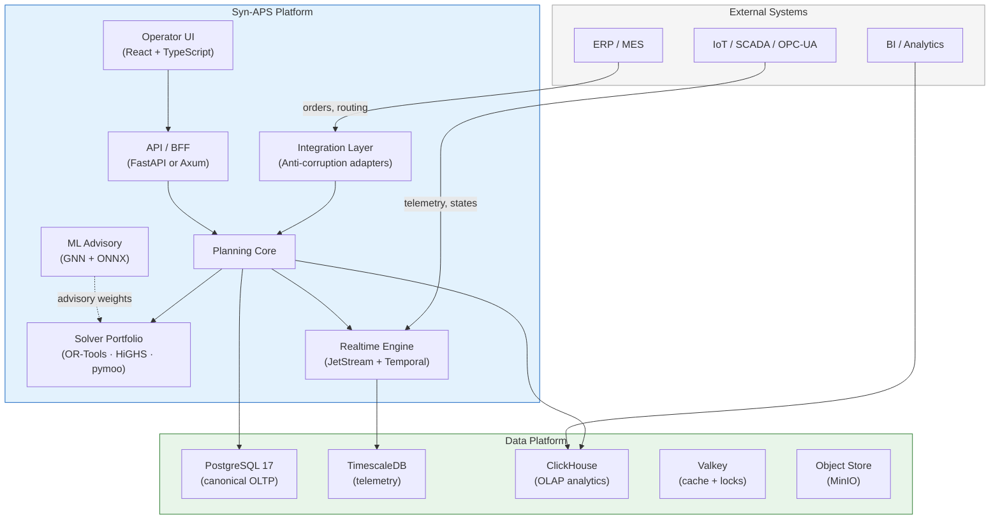

<p align="center">
  <strong>Syn-APS</strong><br/>
  <em>Universal Advanced Planning &amp; Scheduling Platform</em>
</p>

<p align="center">
  <a href="LICENSE"></a>
  <a href="https://www.python.org/"></a>
  <a href="https://github.com/syn-aps/syn-aps/actions"></a>
</p>

---

**Syn-APS** is an open-source, industry-agnostic platform for multi-objective job-shop scheduling with sequence-dependent setup times, AI advisory, and a domain parametrization framework that adapts to any manufacturing, logistics, energy, or scientific scheduling vertical.

<details>
<summary>🇷🇺 Краткое описание</summary>

**Syn-APS** — открытая платформа оперативного планирования производства (APS). Ядро решает задачу многокритериального планирования (MO-FJSP-SDST) с детерминированным базовым уровнем, портфелем солверов, AI-advisory слоем и параметризацией под любую отрасль: металлургия, фармацевтика, электроника, пищевая промышленность, логистика, энергетика, наука.

</details>

## Canonical Problem Form

Syn-APS models scheduling as **MO-FJSP-SDST-ML-ARC**:

| Symbol | Meaning |
|--------|---------|
| **MO** | Multi-Objective optimization |
| **FJSP** | Flexible Job-Shop Scheduling Problem |
| **SDST** | Sequence-Dependent Setup Times |
| **ML** | Machine Learning advisory layer |
| **ARC** | Auxiliary Resources & Constraints |

**Objective function:**

$$J = w_1 T + w_2 S + w_3 M + w_4 B + w_5 R + w_6 E$$

| Term | Description |
|------|-------------|
| $T$ | Total weighted tardiness |
| $S$ | Total setup time |
| $M$ | Material waste / auxiliary resource cost |
| $B$ | Load imbalance across work centers |
| $R$ | Schedule stability (delta from previous plan) |
| $E$ | Energy cost |

**Robust extension:**

$$J_{\text{robust}} = \mathbb{E}[J(\xi)] + \lambda\, \text{CVaR}_\alpha(J(\xi)) + \mu\, \Delta_{\text{stability}}$$

## Architecture



## Solver Portfolio

| Regime | Solver | When |
|--------|--------|------|
| Full rebuild | GREED/ATCS + LNS | Daily or shift-level replan |
| Local repair | Frozen prefix + LNS + CP-SAT | Machine failure, rush order |
| Bottleneck | CP-SAT (exact) | Critical resource window |
| Energy | HiGHS LP/MIP | Tariff-aware shift allocation |
| Pareto | pymoo NSGA-III | Multi-stakeholder trade-off |
| Hyperparameter | Optuna | Solver configuration tuning |

## Domain Parametrization

Syn-APS is **not** a single-industry tool. The universal schema uses `domain_attributes JSONB` columns to adapt to any vertical:

| Industry | Key Parameters | Example |
|----------|---------------|---------|
| Metallurgy | alloy grade, ingot temperature, rolling pass | [metallurgy.json](schema/examples/metallurgy.json) |
| Pharmaceuticals | batch size, clean room class, expiry tracking | [pharma.json](schema/examples/pharma.json) |
| Semiconductor | wafer lot, reticle set, clean room zone | [semiconductor.json](schema/examples/semiconductor.json) |
| Food & Beverage | allergen class, pasteurization temp, shelf life | [food.json](schema/examples/food.json) |
| Data Centers | VM type, rack zone, power/cooling envelope | [datacenter.json](schema/examples/datacenter.json) |
| Energy & Utilities | unit commitment, ramp rate, emission cap | [energy.json](schema/examples/energy.json) |
| Logistics & Warehousing | vehicle type, dock slot, route window | [logistics.json](schema/examples/logistics.json) |
| Aerospace & Defense | flight test slot, MRO bay, certification hold | [aerospace.json](schema/examples/aerospace.json) |

See [docs/domains/](docs/domains/) for full parametrization guides.

## Quick Start

```bash
# Clone
git clone https://github.com/syn-aps/syn-aps.git
cd syn-aps

# Install solver (Python 3.11+)
pip install -e ".[dev]"

# Run a benchmark instance
python -m syn_aps.cli solve benchmark/instances/demo_10x5.json

# Run tests
pytest
```

## Repository Structure

```
syn-aps/
├── docs/
│   ├── architecture/       # System architecture & design decisions
│   ├── domains/             # Industry parametrization guides
│   ├── evolution/           # Future vectors (Digital Twin, LLM, FL, Quantum)
│   └── research/            # Literature review, roadmap, benchmarks
├── schema/
│   ├── ddl/                 # PostgreSQL DDL (universal tables)
│   └── examples/            # Domain-specific JSON examples
├── solver/
│   └── syn_aps/             # Python solver package
│       ├── model/           # Data model (dataclasses)
│       ├── solvers/         # GREED, CP-SAT, LNS, NSGA-III
│       ├── repair/          # Incremental repair engine
│       └── validators/      # Feasibility & constraint checkers
├── benchmark/
│   ├── instances/           # Problem instances (JSON)
│   └── runner.py            # Benchmark CLI
├── .github/                 # CI workflows & templates
├── LICENSE                  # MIT
├── CONTRIBUTING.md
├── CITATION.cff
└── README.md                # ← You are here
```

## Roadmap

| Phase | Milestone | Scope |
|-------|-----------|-------|
| 0 | Data contract freeze | Canonical schema, domain mapping, KPI tree |
| 1 | Deterministic pilot | Import pipeline, GREED scheduler, basic operator board |
| 2 | Repair & realtime | Incremental repair, override flow, event streaming |
| 3 | Analytics & XAI | ClickHouse projections, explanation service |
| 4 | ML advisory | GNN weight predictor, shadow evaluation, MLOps |
| 5 | Selective extraction | Service boundaries driven by real evidence |
| 6 | Digital Twin & LLM | DES simulation, NL copilot (on-prem) |
| 7 | Federated Learning | Multi-plant learning, edge AI |
| 8 | Quantum Readiness | QUBO formulation, hybrid solver |

## Key Design Principles

1. **Model-first** — canonical mathematical form before any code
2. **Deterministic baseline** — every AI recommendation has a deterministic fallback
3. **Evolutionary architecture** — modular monolith first, extract services by evidence
4. **Event-native** — all state changes are auditable domain events
5. **Explainability** — every scheduling decision can be inspected and challenged
6. **Industrial safety** — degraded modes are explicit, not hidden behind scores

## Technology Stack (Reference)

| Layer | Primary | Alternative |
|-------|---------|-------------|
| Solver kernel | OR-Tools CP-SAT | HiGHS, pymoo, Optuna |
| ML framework | PyTorch + PyG | ONNX Runtime (inference) |
| Backend | FastAPI (Python) | Axum (Rust, hot path) |
| Frontend | React 19 + TypeScript | — |
| OLTP | PostgreSQL 17 | — |
| OLAP | ClickHouse | TimescaleDB (telemetry) |
| Events | NATS JetStream | — |
| Workflows | Temporal | — |
| Cache | Valkey | — |
| IAM | Keycloak + OPA | — |
| Platform | RKE2 / K3s | — |
| CI/CD | GitHub Actions + ArgoCD | — |
| Observability | Prometheus + Grafana + Loki + Tempo | — |

## Contributing

See [CONTRIBUTING.md](CONTRIBUTING.md). We especially welcome:

- New **domain parametrizations** for underserved industries
- **Benchmark instances** from real or realistic problem sets
- **Solver improvements** — heuristics, neighborhoods, exact methods
- **Translations** of documentation

## License

[MIT](LICENSE) — Syn-APS Contributors.

## Citation

If you use Syn-APS in academic work, please cite via [CITATION.cff](CITATION.cff).
