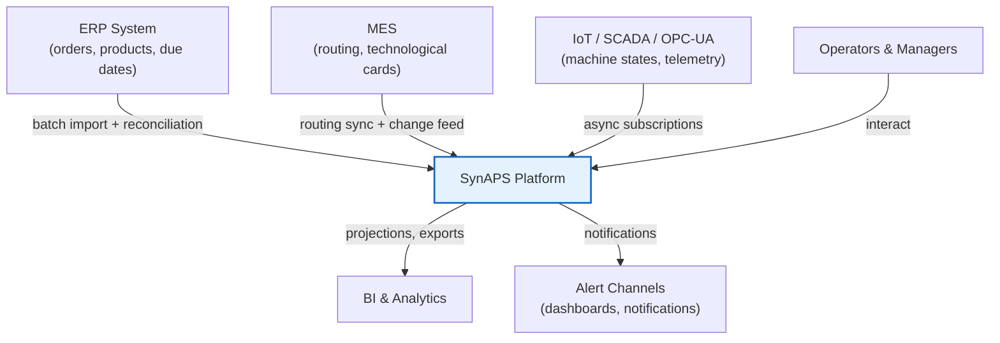
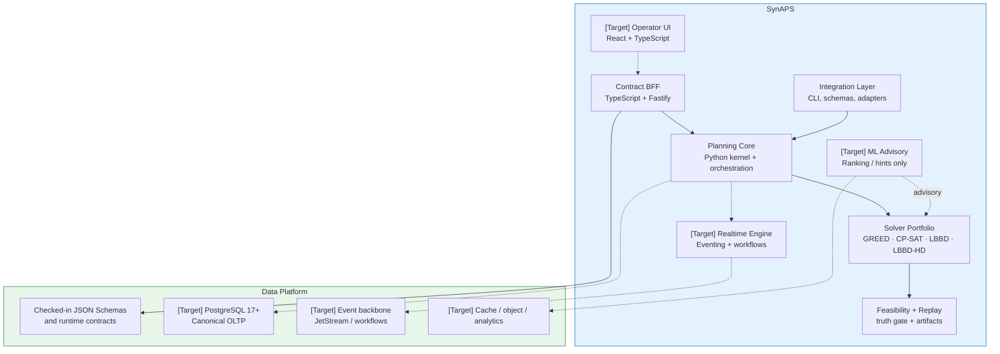
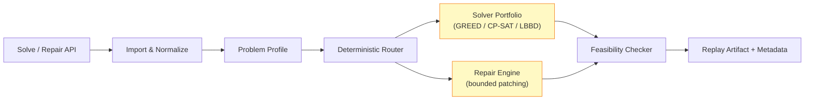

# Architecture Overview

<details>
<summary>🇷🇺 Обзор архитектуры</summary>

SynAPS строится как модульный монолит с чёткими границами контекстов. Сервисная декомпозиция допустима только после подтверждённых bottleneck'ов. Все решения по планированию аудитируемы. AI-рекомендации — advisory, не authoritative.

</details>

## Design Principles

| ID | Principle | Rationale |
|----|-----------|-----------|
| P1 | **Model-first** | Canonical mathematical form precedes any code. The current kernel is MO-FJSP-SDST-ARC; the extended MO-FJSP-SDST-ML-ARC label is reserved for future advisory layers. |
| P2 | **Deterministic baseline** | Every AI/ML recommendation has a deterministic fallback. If ML advisory is unavailable, the system produces a valid schedule using rule-based solvers alone. |
| P3 | **Evolutionary architecture** | Start as a modular monolith. Extract services only when production evidence (load, change cadence, team boundaries) justifies the operational cost. |
| P4 | **Event-ready** | The standalone repo models state so that replay and eventing can be layered on later, but it does not currently ship an event bus or workflow runtime. |
| P5 | **Explainability** | The current runtime exposes routing reasons, replay artifacts, and repair diffs; richer operator-facing XAI remains a target layer. |
| P6 | **Industrial safety** | Degraded modes are explicit and operator-visible. A silent fallback that hides instability is a defect, not a feature. |

## System Context (C4 Level 1)



## Container Diagram (C4 Level 2)



## Component View (Planning Core)



## Architecture Decision Records

| ADR | Decision |
|-----|----------|
| ADR-001 | PostgreSQL is canonical source of truth |
| ADR-002 | Modular monolith first, selective extraction later |
| ADR-003 | Deterministic scheduler is mandatory baseline |
| ADR-004 | Target: JetStream/eventing and workflow orchestration stay outside the standalone runtime boundary |
| ADR-005 | ClickHouse is analytics plane, not operational truth |
| ADR-006 | AI is advisory, never sole feasibility authority |
| ADR-007 | Commercial UI components allowed only behind replaceable boundary |
| ADR-008 | Every publication/override action is auditable |
| ADR-009 | Integration adapters isolate external system quirks |
| ADR-010 | Degraded modes must be explicit and operator-visible |
| ADR-011 | Solver portfolio routes by problem regime |
| ADR-012 | Target: ONNX CPU-first inference; Python remains the experimentation surface |
| ADR-013 | Signed artifacts and SBOM are part of production readiness |
| ADR-014 | Target: Digital Twin via SimPy DES, not proprietary simulation |
| ADR-015 | LLM Copilot on-prem only; no data leaves the perimeter |
| ADR-016 | Target: Federated Learning with differential privacy guarantees |
| ADR-017 | Target: Quantum readiness via QUBO formulation, classical fallback mandatory |
| ADR-018 | Language follows boundary and hot path: TypeScript at the edge, Python for optimizer and ML orchestration, Rust for native kernels |

## Rollout Model

```
Phase 0   →   Phase 1   →   Phase 2   →   Phase 3-4   →   Phase 5+
Discovery     Pilot Core    Repair +      Analytics +     Selective
& Contract    (1 line,      Realtime      ML Advisory     Extraction
Freeze        1 shift)      Loop                          & Evolution
```

**Key rule:** No service extraction before production evidence of bottlenecks. No ML promotion without replay-validated improvement over deterministic baseline.

## Language Boundary

SynAPS is intentionally polyglot at production scale:

1. **TypeScript** owns operator UI and control-plane edges.
2. **Python** owns exact solver orchestration, ML advisory, and simulation-heavy work.
3. **Rust** owns measured hot paths such as heuristic kernels, feasibility checks, and future metaheuristic workers.
4. **Rules and policy** should stay declarative where possible instead of being buried in solver code.
5. The current verified boundary to external runtimes is the JSON request/response contract under `schema/contracts/` plus the bounded CLI/package entrypoints.
6. The current public network proof is the minimal TypeScript BFF in `control-plane/`, which validates the runtime contract and invokes the Python kernel over the contract CLI.

See [Language & Runtime Strategy](06_LANGUAGE_AND_RUNTIME_STRATEGY.md) for the full contract.


### Solver Portfolio — Implementation Summary

The solver portfolio is the core engineering asset. The current shipped runtime is Python 3.12+ plus a minimal TypeScript BFF for HTTP contract validation.

| Component | Source | LOC | Primary Algorithm |
|-----------|--------|-----|-------------------|
| CP-SAT Exact Solver | `cpsat_solver.py` | 687 | OR-Tools CP-SAT: IntervalVar + Circuit (SDST) + NoOverlap + Cumulative (ARC) |
| LBBD Decomposition | `lbbd_solver.py` | 856 | HiGHS MIP master + CP-SAT sub + Nogood/Capacity/Setup/Load-Balance cuts |
| LBBD-HD (Parallel) | `lbbd_hd_solver.py` | 1 145 | + ProcessPoolExecutor + ARC-aware partitioning + topological post-assembly |
| Greedy ATCS Dispatch | `greedy_dispatch.py` | 261 | Log-space ATCS priority index, $O(N \log N)$ |
| Pareto Slice | `pareto_slice_solver.py` | 86 | Two-stage $\varepsilon$-constraint |
| Incremental Repair | `incremental_repair.py` | 281 | Neighbourhood radius + greedy fallback + micro-CP-SAT |
| Portfolio Router | `router.py` | 217 | Deterministic regime×size→solver decision tree (6 regimes) |
| Graph Partitioning | `partitioning.py` | 213 | Coarsening (BFS) + FFD Bin-Packing + Refinement |
| Solver Registry | `registry.py` | 175 | 13 pre-configured profiles (GREED through LBBD-20-HD) |
| FeasibilityChecker | `feasibility_checker.py` | 251 | 7-class independent validator (event-sweep algorithm) |
| Data Model | `model.py` | 274 | Pydantic v2, 8 entity classes, DAG + SDST validation |
| Control-Plane BFF | `control-plane/src/*.ts` | 609 | Fastify + AJV + Python bridge (TypeScript) |
| **Total** | | **5 055** | |

The **Portfolio Router** automatically selects the solver based on: operational regime (NOMINAL, RUSH_ORDER, BREAKDOWN, MATERIAL_SHORTAGE, INTERACTIVE, WHAT_IF), time budget, and instance size. No ML — deterministic routing.


## Technology Stack

Only the Python kernel, checked-in contracts, replay and benchmark surfaces, and the minimal TypeScript BFF ship in the current standalone repository. The broader platform matrix below describes the intended integrated deployment stack rather than the present standalone runtime.

| Layer | Primary | Reserve / Alternative |
|-------|---------|----------------------|
| **Frontend** | React 19 + TypeScript + Vite | — |
| **State management** | TanStack Query + Zustand | — |
| **API / BFF** | TypeScript on Node.js or Bun | FastAPI or Axum for optimizer-adjacent service boundaries |
| **Solver kernel** | OR-Tools CP-SAT | HiGHS (LP/MIP), pymoo (NSGA-III) |
| **Heuristic core** | Custom GREED/ATCS (Rust or Python) | — |
| **Hyperparameter** | Optuna | — |
| **ML framework** | PyTorch + PyG (training) | — |
| **ML inference** | ONNX Runtime (CPU-first) | PyTorch (experimental) |
| **ML tracking** | MLflow + MinIO | — |
| **OLTP** | PostgreSQL 17 | — |
| **Telemetry store** | TimescaleDB | — |
| **OLAP** | ClickHouse | — |
| **Cache / locks** | Valkey | — |
| **Object store** | MinIO | — |
| **Event streaming** | NATS JetStream | — |
| **Workflow engine** | Temporal | — |
| **IAM** | Keycloak + OPA | — |
| **Workload identity** | SPIFFE / SPIRE | — |
| **Platform** | RKE2 / K3s | — |
| **Network** | Cilium + Hubble | — |
| **GitOps** | Argo CD | — |
| **Observability** | Prometheus + Grafana + Loki + Tempo | — |
| **Supply chain** | Syft + Grype + cosign | Trivy |
| **DES** | SimPy 4.x | Salabim |
| **LLM inference** | vLLM / Ollama | llama.cpp (CPU) |
| **RL** | Stable-Baselines3 | d3rlpy (offline RL) |

## Next

- [Canonical Form](02_CANONICAL_FORM.md) — mathematical formalization
- [Solver Portfolio](03_SOLVER_PORTFOLIO.md) — solver selection and routing
- [Data Model](04_DATA_MODEL.md) — universal schema and events
- [Deployment](05_DEPLOYMENT.md) — infrastructure and operations
- [Language & Runtime Strategy](06_LANGUAGE_AND_RUNTIME_STRATEGY.md) — polyglot boundaries and migration rules
- [Runtime Contract](07_RUNTIME_CONTRACT.md) — current TypeScript ↔ Python invocation boundary
