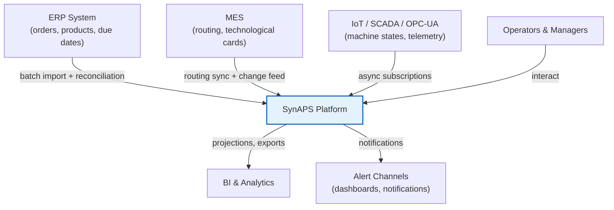
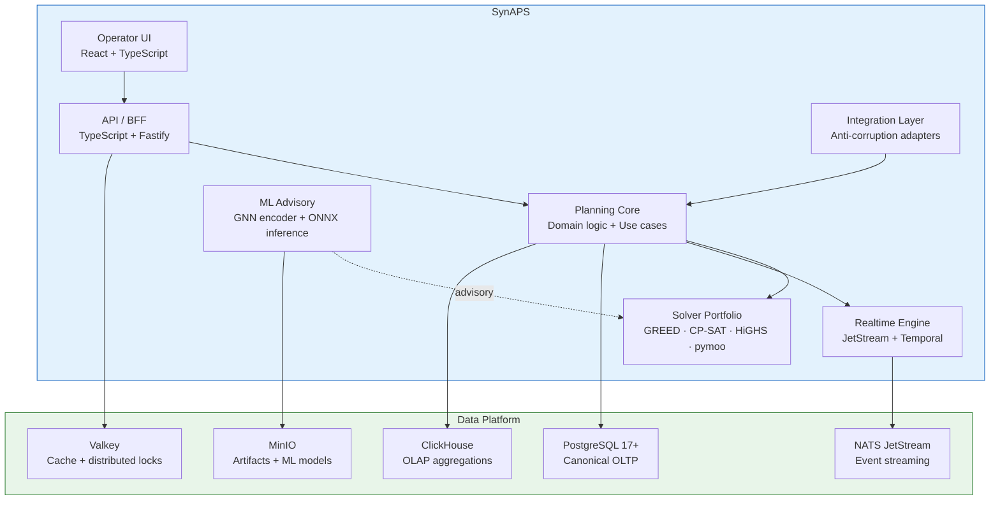

# Architecture Overview

<details>
<summary>🇷🇺 Обзор архитектуры</summary>

SynAPS строится как модульный монолит с чёткими границами контекстов. Сервисная декомпозиция допустима только после подтверждённых bottleneck'ов. Все решения по планированию аудитируемы. AI-рекомендации — advisory, не authoritative.

</details>

## Design Principles

| ID | Principle | Rationale |
|----|-----------|-----------|
| P1 | **Model-first** | Canonical mathematical form (MO-FJSP-SDST-ML-ARC) precedes any code. Every solver, heuristic, and ML model maps back to the formal objective. |
| P2 | **Deterministic baseline** | Every AI/ML recommendation has a deterministic fallback. If ML advisory is unavailable, the system produces a valid schedule using rule-based solvers alone. |
| P3 | **Evolutionary architecture** | Start as a modular monolith. Extract services only when production evidence (load, change cadence, team boundaries) justifies the operational cost. |
| P4 | **Event-native** | All state changes are domain events with causal ordering, replay capability, and audit trail. Events drive projections, analytics, and inter-component communication. |
| P5 | **Explainability** | Every scheduling assignment can be inspected: which objective dominated, what alternatives existed, what constraints were active. Operators can challenge and override. |
| P6 | **Industrial safety** | Degraded modes are explicit and operator-visible. A silent fallback that hides instability is a defect, not a feature. |

## System Context (C4 Level 1)



## Container Diagram (C4 Level 2)



## Component View (Planning Core)


## Architecture Decision Records

| ADR | Decision |
|-----|----------|
| ADR-001 | PostgreSQL is canonical source of truth |
| ADR-002 | Modular monolith first, selective extraction later |
| ADR-003 | Deterministic scheduler is mandatory baseline |
| ADR-004 | JetStream for eventing, Temporal for durable workflows |
| ADR-005 | ClickHouse is analytics plane, not operational truth |
| ADR-006 | AI is advisory, never sole feasibility authority |
| ADR-007 | Commercial UI components allowed only behind replaceable boundary |
| ADR-008 | Every publication/override action is auditable |
| ADR-009 | Integration adapters isolate external system quirks |
| ADR-010 | Degraded modes must be explicit and operator-visible |
| ADR-011 | Solver portfolio routes by problem regime |
| ADR-012 | ONNX CPU-first inference; Python for training |
| ADR-013 | Signed artifacts and SBOM are part of production readiness |
| ADR-014 | Digital Twin via SimPy DES, not proprietary simulation |
| ADR-015 | LLM Copilot on-prem only; no data leaves the perimeter |
| ADR-016 | Federated Learning with differential privacy guarantees |
| ADR-017 | Quantum readiness via QUBO formulation, classical fallback mandatory |
| ADR-018 | Language follows boundary and hot path: TypeScript at the edge, Python for optimizer and ML orchestration, Rust for native kernels |

## Rollout Model

```
Phase 0   →   Phase 1   →   Phase 2   →   Phase 3-4   →   Phase 5+
Discovery     Pilot Core    Repair +      Analytics +     Selective
& Contract    (1 line,      Realtime      ML Advisory     Extraction
Freeze        1 shift)      Loop                          & Evolution
```

**Key rule:** No service extraction before production evidence of bottlenecks. No ML promotion without replay-validated improvement over deterministic baseline.

## Language Boundary

SynAPS is intentionally polyglot at production scale:

1. **TypeScript** owns operator UI and control-plane edges.
2. **Python** owns exact solver orchestration, ML advisory, and simulation-heavy work.
3. **Rust** owns measured hot paths such as heuristic kernels, feasibility checks, and future metaheuristic workers.
4. **Rules and policy** should stay declarative where possible instead of being buried in solver code.
5. The current verified boundary to external runtimes is the JSON request/response contract under `schema/contracts/` plus the bounded CLI/package entrypoints.
6. The current public network proof is the minimal TypeScript BFF in `control-plane/`, which validates the runtime contract and invokes the Python kernel over the contract CLI.

See [Language & Runtime Strategy](06_LANGUAGE_AND_RUNTIME_STRATEGY.md) for the full contract.

## Technology Stack

| Layer | Primary | Reserve / Alternative |
|-------|---------|----------------------|
| **Frontend** | React 19 + TypeScript + Vite | — |
| **State management** | TanStack Query + Zustand | — |
| **API / BFF** | TypeScript on Node.js or Bun | FastAPI or Axum for optimizer-adjacent service boundaries |
| **Solver kernel** | OR-Tools CP-SAT | HiGHS (LP/MIP), pymoo (NSGA-III) |
| **Heuristic core** | Custom GREED/ATCS (Rust or Python) | — |
| **Hyperparameter** | Optuna | — |
| **ML framework** | PyTorch + PyG (training) | — |
| **ML inference** | ONNX Runtime (CPU-first) | PyTorch (experimental) |
| **ML tracking** | MLflow + MinIO | — |
| **OLTP** | PostgreSQL 17 | — |
| **Telemetry store** | TimescaleDB | — |
| **OLAP** | ClickHouse | — |
| **Cache / locks** | Valkey | — |
| **Object store** | MinIO | — |
| **Event streaming** | NATS JetStream | — |
| **Workflow engine** | Temporal | — |
| **IAM** | Keycloak + OPA | — |
| **Workload identity** | SPIFFE / SPIRE | — |
| **Platform** | RKE2 / K3s | — |
| **Network** | Cilium + Hubble | — |
| **GitOps** | Argo CD | — |
| **Observability** | Prometheus + Grafana + Loki + Tempo | — |
| **Supply chain** | Syft + Grype + cosign | Trivy |
| **DES** | SimPy 4.x | Salabim |
| **LLM inference** | vLLM / Ollama | llama.cpp (CPU) |
| **RL** | Stable-Baselines3 | d3rlpy (offline RL) |

## Next

- [Canonical Form](02_CANONICAL_FORM.md) — mathematical formalization
- [Solver Portfolio](03_SOLVER_PORTFOLIO.md) — solver selection and routing
- [Data Model](04_DATA_MODEL.md) — universal schema and events
- [Deployment](05_DEPLOYMENT.md) — infrastructure and operations
- [Language & Runtime Strategy](06_LANGUAGE_AND_RUNTIME_STRATEGY.md) — polyglot boundaries and migration rules
- [Runtime Contract](07_RUNTIME_CONTRACT.md) — current TypeScript ↔ Python invocation boundary
