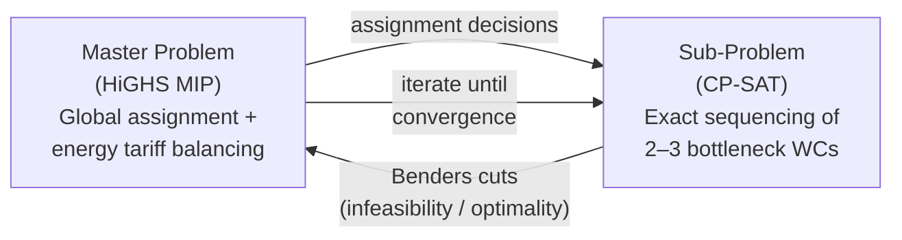

# 03 — Hybrid Solver Portfolio

> **Scope**: Current deterministic solver portfolio, dispatch regimes, LBBD decomposition, bounded repair, and explicitly marked target ML/XAI layers.

<details><summary>🇷🇺 Краткое описание</summary>

Детерминированный портфель решателей: от жадных эвристик (миллисекунды) до точных CP-SAT и LBBD/LBBD-HD решателей (секунды-минуты). Портфель автоматически выбирает стратегию в зависимости от режима и масштаба задачи. Logic-Based Benders Decomposition (LBBD) разделяет глобальное назначение и точное секвенсирование узких мест. ML-advisory, XAI и model-governance слои ниже описаны только как target architecture и не являются текущим runtime в этом репозитории.
</details>

---

## 1. Architectural Principle: Deterministic Kernel + Explicit Roadmap Boundary

```
┌─────────────────────────────────────────────────┐
│        [Target] Operator UX / Human Override     │
│      (review, edit, and accept returned diff)    │
├─────────────────────────────────────────────────┤
│      [Target] Explanation and audit surfaces     │
│   (routing reasons, diffs, richer future XAI)    │
├─────────────────────────────────────────────────┤
│        [Target] Advisory ML / RL hints           │
│   (ranking, parameter hints, bounded guidance)   │
├─────────────────────────────────────────────────┤
│             Incremental Repair Engine            │
│     (local subgraph repair, freeze unaffected)   │
├─────────────────────────────────────────────────┤
│                Exact Solver Layer                │
│      (CP-SAT, LBBD, LBBD-HD, Pareto Slice)      │
├─────────────────────────────────────────────────┤
│           Constructive Heuristic Layer           │
│       (GREED/ATCS dispatching, O(n log n))       │
└─────────────────────────────────────────────────┘
```

Current repository truth: the standalone runtime ships the constructive heuristic layer, the exact solver layer, bounded repair, the independent feasibility validator, and a thin TypeScript contract BFF. Sections 6-9 describe target or research surfaces and are not live runtime claims.

**Iron rule**: any future ML surface may only advise; deterministic solvers execute. No advisory output may bypass the feasibility checker.

---

## 2. Solver Portfolio — Operational Regimes

The **Solver Router** selects one standalone solver configuration based on operational context, size, and latency budget. Incremental repair is a separate runtime surface used when an existing schedule is already available.

| Regime | Trigger | Solver Chain | Latency | Quality |
|--------|---------|-------------|---------|---------|
| **NOMINAL** | Default planning cycle | `CPSAT-10`→`CPSAT-30`→`LBBD-10`→`ALNS-300`→`ALNS-500`→`RHC-ALNS`→`LBBD-HD` depending on size, latency budget, and constraints | 10–600 s | exact-first, metaheuristic for large instances |
| **RUSH_ORDER** | Priority order injection | `CPSAT-10` for small windows, otherwise `GREED`; repair API handles schedule-aware patching | < 1–10 s | bounded |
| **BREAKDOWN** | Machine failure event | `CPSAT-10` for small windows, otherwise `GREED`; repair API handles local repair | < 1–10 s | bounded |
| **MATERIAL_SHORTAGE** | Inventory alarm | `CPSAT-30`, `LBBD-5`, or `LBBD-10-HD` | 30–300 s | exact on constrained subproblems |
| **INTERACTIVE** | Low-latency operator feedback | `GREED` | < 1 s | feasible-first |
| **WHAT_IF** | Scenario analysis, no commit | `CPSAT-EPS-SETUP-110`, `CPSAT-30`, `LBBD-10`, or `LBBD-10-HD` depending on size and setup sensitivity | 30–300 s | trade-off exploration |

---


### 2.1. Implementation Evidence — Code Line Counts

The following table lists exact source file sizes for every solver component in the current repository.
These are **measured line counts**, not estimates.

| Component | Source File | LOC | Primary Algorithm |
|-----------|------------|-----|-------------------|
| **CP-SAT Exact Solver** | `synaps/solvers/cpsat_solver.py` | 772 | IntervalVar + Circuit (SDST) + NoOverlap + Cumulative (ARC) |
| **LBBD Decomposition** | `synaps/solvers/lbbd_solver.py` | 969 | HiGHS MIP master + CP-SAT sub + no-good/capacity/setup-cost/load-balance cuts |
| **LBBD-HD (Parallel)** | `synaps/solvers/lbbd_hd_solver.py` | 1 324 | Hierarchical LBBD + ProcessPoolExecutor + topological post-assembly |
| **Greedy ATCS Dispatch** | `synaps/solvers/greedy_dispatch.py` | 296 | Log-space ATCS priority index, $O(N \log N)$ |
| **Pareto Slice** | `synaps/solvers/pareto_slice_solver.py` | 104 | Two-stage $\varepsilon$-constraint (Makespan-then-Secondary) |
| **Incremental Repair** | `synaps/solvers/incremental_repair.py` | 318 | Neighbourhood radius + greedy fallback + micro-CP-SAT |
| **Portfolio Router** | `synaps/solvers/router.py` | 252 | Deterministic regime×size→solver decision tree |
| **FeasibilityChecker** | `synaps/solvers/feasibility_checker.py` | 280 | Independent post-solve validator with event-sweep ARC checks |
| **RHC Solver** | `synaps/solvers/rhc_solver.py` | 2 972 | Rolling-horizon temporal decomposition; ALNS/CP-SAT inner; adaptive admission + budget guard |
| **ALNS Solver** | `synaps/solvers/alns_solver.py` | 1 837 | 5-operator LNS (random/worst/related/machine_segment/precedence_chain) + SA + adaptive weights |
| **Graph Partitioning** | `synaps/solvers/partitioning.py` | 271 | Coarsening (BFS ARC-affinity) + FFD Bin-Packing + Refinement |
| **Solver Registry** | `synaps/solvers/registry.py` | 444 | 21 pre-configured solver profiles + RHC-ALNS admission/budget tuning |
| **Data Model** | `synaps/model.py` | 333 | Pydantic v2 schema + cross-reference validator |
| **Control-Plane BFF** | `control-plane/src/*.ts` | 674 | Fastify + OpenAPI/AJV + Python bridge (TypeScript) |
| **Total Solver Core** | | **9 124** | |
| **Total with Support** | | **10 846** | |

### 2.2. Solver Registry — 21 Pre-Configured Profiles (registry.py, 444 LOC)

The `SolverRegistry` (`registry.py`) provides named profiles used by the Portfolio Router:

| Profile | Solver Class | Time Limit | Iterations | Use Case |
|---------|-------------|------------|------------|----------|
| `GREED` | GreedyDispatch | — | — | Instant constructive plan ($< 1$ s) |
| `GREED-K1-3` | GreedyDispatch | — | — | Constructive heuristic with longer tardiness look-ahead |
| `BEAM-3` | BeamSearchDispatch | — | width=3 | Filtered beam search for SDST-sensitive instances |
| `BEAM-5` | BeamSearchDispatch | — | width=5 | Extended beam search for complex SDST matrices |
| `CPSAT-10` | CpSatSolver | 10 s | — | Small instances ($\leq 20$ ops) |
| `CPSAT-30` | CpSatSolver | 30 s | — | Medium instances ($\leq 120$ ops) |
| `CPSAT-120` | CpSatSolver | 120 s | — | Long-budget exact |
| `CPSAT-EPS-SETUP-110` | ParetoSliceCpSat | 30 s | stage1=10 s | $\varepsilon$-constraint on setup cost |
| `CPSAT-EPS-TARD-110` | ParetoSliceCpSat | 30 s | stage1=10 s | $\varepsilon$-constraint on tardiness |
| `CPSAT-EPS-MATERIAL-110` | ParetoSliceCpSat | 30 s | stage1=10 s | $\varepsilon$-constraint on material loss |
| `LBBD-5` | LbbdSolver | 30 s | 5 | Medium decomposition |
| `LBBD-10` | LbbdSolver | 60 s | 10 | Full decomposition |
| `LBBD-5-HD` | LbbdHdSolver | 120 s | 5 | Industrial ($\leq 50$K ops) |
| `LBBD-10-HD` | LbbdHdSolver | 300 s | 10 | Large factory |
| `LBBD-20-HD` | LbbdHdSolver | 600 s | 20 | Extreme (50K+ ops, experimental — use RHC-ALNS as validated path) |
| `ALNS-300` | AlnsSolver | 120 s | 300 | Metaheuristic for 1K–10K ops |
| `ALNS-500` | AlnsSolver | 300 s | 500 | Metaheuristic for 10K–50K ops |
| `ALNS-1000` | AlnsSolver | 600 s | 1000 | Extended ALNS for 50K+ ops |
| `RHC-ALNS` | RhcSolver (ALNS inner) | 600 s | 8h windows | Temporal decomposition for 50K–100K+ ops |
| `RHC-CPSAT` | RhcSolver (CP-SAT inner) | 300 s | 8h windows | Temporal decomposition with exact per-window solve |
| `RHC-GREEDY` | RhcSolver (Greedy inner) | 120 s | 8h windows | Fast temporal decomposition baseline for 100K+ ops |

### 2.3. Portfolio Router — Deterministic Solver Selection Logic

The **Portfolio Router** (`router.py`, 252 LOC) selects the solver profile using three inputs: **operational regime**, **time budget** (`preferred_max_latency_s`), and **instance size** ($N$ = number of operations).

```
Routing Decision Tree (simplified):

If latency ≤ 1 s                  → GREED
If regime == INTERACTIVE           → GREED
If regime == BREAKDOWN or RUSH_ORDER:
    If N ≤ 30                      → CPSAT-10
    Else                           → GREED
If regime == MATERIAL_SHORTAGE:
    If N ≤ 120                     → CPSAT-30
    If N ≤ 500                     → LBBD-5
    Else                           → LBBD-10-HD
If regime == WHAT_IF or exact_required:
    If N ≤ 40                      → CPSAT-10 or CPSAT-EPS-*
    If N ≤ 500                     → LBBD-10
    If N ≤ 50K                     → LBBD-10-HD
    Else                           → LBBD-20-HD
Default (NOMINAL):
    If N ≤ 20                      → CPSAT-10
    If N ≤ 120                     → CPSAT-30
    If N ≤ 500                     → LBBD-10
    If latency > 120s and N ≤ 10K  → ALNS-300
    If latency > 300s and N ≤ 50K  → ALNS-500
    If latency > 600s and N > 50K  → RHC-ALNS
    If N ≤ 50K                     → LBBD-10-HD
    Else                           → LBBD-20-HD
```

The router is **deterministic** — same inputs always produce the same solver choice. No ML, no randomness. ALNS/RHC routes are only activated when the latency budget is generous and `exact_required` is not set; otherwise LBBD-HD remains the default large-scale path.


## 3. Logic-Based Benders Decomposition (LBBD)

Greedy heuristics based on priority rules (ATCS) are blind to bottlenecks. LBBD splits the problem into two cooperating layers:



### Master Problem (Global Assignment)
- **Solver**: HiGHS v1.8+ (LP/MIP)
- **Decides**: Operation → WorkCenter assignment with relaxed timing and capacity bounds
- **Objective**: Minimize relaxed makespan and tighten lower bounds before exact sequencing
- **Scale**: All $N$ operations, all $M$ work centers — but relaxed (no sequencing detail)

### Sub-Problem (Bottleneck Sequencing)
- **Solver**: Google OR-Tools CP-SAT v9.10+
- **Decides**: Exact operation order on 2–3 bottleneck work centers
- **Constraints**: `NO_OVERLAP` intervals with SDST transition matrix, plus auxiliary resource capacity across setup and processing windows
- **Complexity reduction**: From $O((M!)^N)$ for the full operating network to solvable clusters of 50–200 operations

### Benders Cut Protocol
1. Master produces global assignment
2. Sub-problem attempts exact sequencing on bottleneck WCs
3. If infeasible → sub-problem generates a **no-good cut** (Benders cut) sent back to Master
4. If feasible but suboptimal → **capacity cuts** (Hooker & Ottosson 2003) tighten the makespan lower bound on the bottleneck machine
5. **Setup-cost cuts** propagate actual SDST costs from detailed sequencing back to the master relaxation
6. **Load-balance cuts** enforce $C_{\max} \geq \sum P / \text{cap}$ as a relaxation-free bound
7. Master re-solves with additional constraints
8. Iterate until convergence (typically 3–8 iterations, 1% optimality gap)

**Formal cut families:**

| # | Cut Family | Formal Expression | Trigger |
|---|-----------|-------------------|---------|
| 1 | Nogood | $\sum_{i \in S} (1 - x_{i,k_i}) \geq 1$ | Subproblem infeasible |
| 2 | Capacity | $C_{\max} \geq \text{LB}_k + \Delta_k$ | Local makespan exceeds relaxation |
| 3 | Setup-Cost | $\text{Setup}_{\text{total}} \geq \sum_{(i,j)} s_{ij}^k$ | Master missed actual SDST |
| 4 | Load-Balance | $C_{\max} \geq \sum_i P_{ik} \cdot x_{ik} / \text{cap}_k$ | Load imbalance |

> **Implemented status (2026-04)**: `LBBD-5` and `LBBD-10` profiles ship with HiGHS master, CP-SAT subproblems, no-good + capacity + setup-cost + load-balance cuts. Verified on `medium_stress_20x4.json` (181 min LBBD vs 289 min GREED). See `synaps/solvers/lbbd_solver.py`.

---


### 3.1. LBBD-HD: Parallel Benders for Industrial Scale (10K–50K+ Operations)

For instances exceeding 500 operations, the standard LBBD hits memory and time limits due to $O(N^2)$ circuit constraints per cluster. `lbbd_hd_solver.py` (1 324 LOC) extends LBBD with **five engineering measures**:

#### Five Engineering Measures

| # | Measure | Description | Complexity Impact |
|---|---------|-------------|-------------------|
| 1 | **Balanced ARC-Aware Partitioning** | Graph coarsening (BFS on shared ARC edges) → FFD bin-packing → refinement splits | $O(N)$ partitioning vs $O(N^2)$ per cluster |
| 2 | **Precedence-Aware Master** | Continuous timing variables `start[i], end[i]` + full DAG edges in HiGHS MIP | Order-of-magnitude tighter relaxation bound |
| 3 | **Greedy ATCS Warm-Start** | GreedyDispatch seeds the first upper bound before LBBD iterations begin | Faster first feasible incumbent |
| 4 | **Parallel Subproblem Execution** | `ProcessPoolExecutor(max_workers=8)` with JSON-serialized problem data | Reduces wall-clock time once cluster count is large enough |
| 5 | **Accelerated Post-Assembly** | Topological sort (Kahn's algorithm) + per-machine heaps for cascade propagation | $O(|O| \log |O| + |\text{DAG}|)$ vs $O(N^3)$ |

#### Master Problem Formulation (LBBD-HD)

$$\min C_{\max}$$
$$\text{s.t.} \quad \sum_{k} x_{ik} = 1 \quad \forall i$$
$$\text{end}[i] = \text{start}[i] + \sum_{k} P_{ik} \cdot x_{ik} \quad \forall i$$
$$\text{start}[j] \geq \text{end}[i] \quad \forall (i,j) \in \text{DAG}$$
$$\sum_{i} P_{ik} \cdot x_{ik} \leq C_{\max} \quad \forall k$$
$$C_{\max} \geq \text{end}[i] \quad \forall i$$
$$+ \text{Benders cuts (capacity, setup, load-balance, critical-path)}$$

#### Parallel Execution Model

```python
# lbbd_hd_solver.py — parallel subproblem dispatch
with ProcessPoolExecutor(max_workers=num_workers) as pool:
    futures = {
        pool.submit(_solve_subproblem, cluster, time_limit): cid
        for cid, cluster in clusters.items()
    }
    for future in as_completed(futures):
        sub_result = future.result()
        if sub_result.makespan > master_cmax:
            cuts.append(generate_capacity_cut(sub_result))
```

Each subproblem is a **full CP-SAT instance** with NoOverlap + Circuit (SDST) + ARC cumulative constraints. Problems are serialized via `model_dump(mode="json")` for process isolation. Falls back to sequential if $\leq 3$ clusters (avoids multiprocessing overhead).

> **Implemented status (2026-04)**: `LBBD-5-HD`, `LBBD-10-HD`, and `LBBD-20-HD` profiles ship with full parallel execution, balanced ARC-aware partitioning, and topological post-assembly. See `synaps/solvers/lbbd_hd_solver.py`, `synaps/solvers/partitioning.py`.


## 4. Constructive Heuristic: GREED / ATCS Dispatch

For the initial schedule and non-bottleneck work centers, the system uses an Apparent Tardiness Cost with Setups (ATCS) composite priority rule (Lee, Bhaskaran & Pinedo 1997):

$$I_j = \frac{w_j}{p_j} \cdot \exp\!\Bigl(-\frac{\max(d_j - p_j - t, 0)}{K_1 \bar{p}}\Bigr) \cdot \exp\!\Bigl(-\frac{s_{lj}}{K_2 \bar{s}}\Bigr)$$

Where:
- $w_j$ — job weight (priority)
- $p_j$ — processing time
- $d_j$ — due date
- $t$ — current time
- $s_{lj}$ — setup time from last completed job $l$ to candidate $j$
- $K_1, K_2$ — look-ahead parameters chosen by fixed defaults, offline tuning, or replay analysis
- $\bar{p}, \bar{s}$ — average processing time and average setup time

**Properties**: $O(n \log n)$ per dispatch step, deterministic, explainable, produces feasible schedules immediately. Serves as warm-start for exact solvers.

> **Implemented status (2026-04)**: Log-space ATCS scoring (avoids float underflow), queue-local setup scale, speed-factor-aware durations. See `synaps/solvers/greedy_dispatch.py`.

---

## 5. Incremental Repair Engine

When disruptions occur (machine breakdown, rush order, material shortage), the system avoids full re-planning:

```
1. DETECT   → Event triggers repair (breakdown, rush order, delay)
2. ISOLATE  → Identify affected subgraph (operations + dependencies)
3. FREEZE   → Lock all unaffected assignments (stability guarantee)
4. REPAIR   → Re-solve only the affected subgraph (CP-SAT or greedy)
5. DIFF     → Generate human-readable diff (moved operations, new times)
6. REVIEW   → Dispatcher or caller reviews the returned diff and accepts or edits it
7. RETURN   → Standalone runtime returns the delta and metadata; persistence or publication belongs to the integration layer outside this repo
```

### Repair Radius Policy

| Disruption Type | Typical Radius | Strategy |
|----------------|---------------|----------|
| Single machine breakdown | 1-hop neighbors | Greedy reallocation |
| Rush order injection | Affected WC + downstream | CP-SAT on subgraph |
| Material shortage | All ops requiring material | Constraint tightening + greedy |
| Quality hold | Batch + successor ops | Freeze + reschedule successors |

> **Implemented status (2026-04)**: `IncrementalRepair` engine with priority-aware greedy redispatch, correct per-order tardiness computation, and post-hoc setup recomputation. The shared dispatch path and `FeasibilityChecker` now reserve auxiliary resources across setup and processing windows, matching CP-SAT semantics. Horizon-bound validation is also enforced. See `synaps/solvers/incremental_repair.py`, `synaps/solvers/_dispatch_support.py`, `synaps/solvers/feasibility_checker.py`.

For parallel work centers, lane virtualization now triggers whenever any sequence-dependent transition cost is non-zero, not only when `setup_minutes > 0`. That means material-loss-only or energy-only transitions still receive exact lane ordering in CP-SAT.

**Stability metric**: $\text{Nervousness} = \frac{|\text{moved operations}|}{|\text{total operations}|}$ — target $< 5\%$ per repair cycle.

---


### 5.1. Pareto Slice Solver ($\varepsilon$-Constraint Multi-Objective)

For decision-makers who need to explore trade-offs between competing objectives (Makespan vs. Setup Cost vs. Material Loss vs. Tardiness), the **Pareto Slice Solver** (`pareto_slice_solver.py`, 104 LOC) implements a two-stage $\varepsilon$-constraint approach:

**Stage 1 — Baseline:** Full CP-SAT solve to find the incumbent Makespan $C_{\max}^*$.

**Stage 2 — Epsilon-Primary:** Fix makespan within a $(1 + \varepsilon)$ envelope and minimize a secondary objective:

$$\min f_{\text{secondary}} \quad \text{s.t.} \quad C_{\max} \leq (1 + \varepsilon) \cdot C_{\max}^*$$

Three pre-configured profiles:
- `CPSAT-EPS-SETUP-110`: minimize total setup time with a 10% makespan slack envelope
- `CPSAT-EPS-TARD-110`: minimize total tardiness with a 10% makespan slack envelope
- `CPSAT-EPS-MATERIAL-110`: minimize total material loss with a 10% makespan slack envelope

**Business effect:** The production director gets a quantified lever: "+1 day delivery slack = -2M ₽ setup savings". This is not a black box — it's a **measurable trade-off**.

> **Implemented status (2026-04)**: Three $\varepsilon$-constraint profiles registered in solver portfolio. Verified via cross-solver consistency tests. See `synaps/solvers/pareto_slice_solver.py`.

### 5.2. Feasibility Checker — Independent 7-Class Validator (280 LOC)

Every schedule — whether from GREED, CP-SAT, LBBD, or Repair — passes through an **independent post-solve validator** before reaching the shop floor. This is architecturally critical: no solver is trusted implicitly.

| Validation Class | Checks | Violation Type |
|-----------------|--------|---------------|
| **Completeness** | All operations assigned exactly once | `DUPLICATE_ASSIGNMENT`, `MISSING_ASSIGNMENT` |
| **Eligibility** | Assigned machine in operation's eligible set | `INELIGIBLE_MACHINE` |
| **Precedence** | Successors start $\geq$ predecessor end | `PRECEDENCE_VIOLATION` |
| **Machine Capacity** | NoOverlap (single) / Cumulative (parallel) | `MACHINE_OVERLAP`, `MACHINE_CAPACITY` |
| **Setup Gaps** | Consecutive ops respect SDST matrix | `SETUP_GAP_VIOLATION` |
| **Auxiliary Resources** | Event-sweep: $\text{in\_use}(r,t) \leq \text{cap}(r)$ | `AUX_RESOURCE_CAPACITY` |
| **Horizon Bounds** | $0 \leq s_{jk},\; s_{jk} + p_{jk} \leq H$ | `HORIZON_BOUND` |

The checker uses an **event-sweep algorithm** for capacity validation: events (start/end of processing, start/end of setup) are sorted by time, and a running counter tracks concurrent resource usage. Complexity: $O(A \cdot E \log E)$ where $A$ = auxiliary resources and $E$ = total events.


## 6. Target ML Advisory Layer (Roadmap)

The standalone repository does **not** ship a runtime HGAT, RL policy, or learned weight predictor today. This section captures the bounded advisory layer that could be added later above the deterministic kernel.

Potential advisory surfaces under evaluation:

| Surface | Intended role | Current status |
|---------|---------------|----------------|
| **Weight prediction** | Suggest ATCS or multi-objective weights | roadmap only |
| **Bottleneck ranking** | Prioritise candidate work centers for deeper exact solving | roadmap only |
| **Setup aggregation hints** | Suggest batching candidates before solving | roadmap only |
| **Duration estimation** | Learn better processing-time priors from history | roadmap only |
| **Disruption classification** | Classify repair triggers from telemetry | roadmap only |

Any future advisory layer remains subordinate to the deterministic solver stack and the feasibility checker.

## 7. Target Governance and Promotion Gates (Roadmap)

No MLflow registry, shadow deployment lane, canary rollout, or automatic rollback pipeline is shipped in the current repository. If learned advisory models are added later, they should stay behind explicit replay validation, shadow-mode evidence, bounded rollout, and rollback criteria.

Suggested gate sequence for a future advisory surface:

1. replay-corpus improvement over a deterministic baseline;
2. shadow-mode logging with no operator-facing effect;
3. bounded canary rollout with deterministic fallback;
4. rollback on any measured KPI regression.

## 8. Target Explainability Contract (Roadmap)

The current repository returns solver metadata, routing reasons, repair diffs, and replay artifacts. Rich SHAP-based explanation layers, before/after Gantt diffs, and operator-facing XAI UI surfaces remain target architecture rather than present runtime.

Current explainability surfaces already shipped in-repo:

| Surface | Available today |
|---------|-----------------|
| **Routing reason** | yes — deterministic router returns an explicit reason string |
| **Repair diff metadata** | yes — repair and replay surfaces return delta-oriented metadata |
| **Replay artifacts** | yes — benchmark/runtime replay artifacts are documented and emitted |
| **SHAP / learned attribution** | no — roadmap only |
| **Operator-facing XAI UI** | no — outside the standalone repo |

---

## 8.1 Execution Language Boundary

The solver portfolio is intentionally polyglot:

1. control-plane orchestration and operator-facing APIs belong outside the hot path;
2. Python remains the canonical proof surface for exact solving and any future advisory experiments;
3. Rust is the target for measured hot-path kernels such as feasibility and ALNS operators.

See [Language & Runtime Strategy](06_LANGUAGE_AND_RUNTIME_STRATEGY.md) for the explicit boundary contract.

---

## 9. Solver Interface Specification (Target: Rust)

If hot-path kernels are later moved to Rust for performance and safety, the Python prototype can map to interfaces like these:

```rust
/// Core solver trait — all solvers implement this
pub trait ScheduleSolver {
    fn solve(&self, problem: &Problem, params: &SolverParams) -> Result<Solution, SolverError>;
    fn name(&self) -> &str;
    fn supports_incremental(&self) -> bool;
}

/// Feasibility verification — separate from solving
pub trait FeasibilityEngine {
    fn check(&self, solution: &Solution, problem: &Problem) -> Vec<Violation>;
    fn is_feasible(&self, solution: &Solution, problem: &Problem) -> bool;
}

/// Repair engine — incremental schedule repair
pub trait RepairEngine {
    fn repair(
        &self,
        current: &Solution,
        disruption: &Disruption,
        problem: &Problem,
    ) -> Result<RepairDelta, RepairError>;
}
```

---

## 10. Determinism & Replay Budget

All solvers must be **deterministic** given the same input:

| Component | Determinism Guarantee |
|-----------|----------------------|
| GREED/ATCS heuristic | Fully deterministic (same seed → same output) |
| CP-SAT | Deterministic with `num_workers=1` and fixed seed |
| HiGHS MIP | Deterministic with single thread + fixed seed |
| NSGA-III | Deterministic with fixed random seed |
| GNN inference | Deterministic (PyTorch `torch.use_deterministic_algorithms(True)`) |

**Replay harness**: Every schedule run is logged with full input snapshot (problem state, solver params, random seed). Any historical schedule can be exactly reproduced for audit and debugging.

---

## References

- Ozolins, E. (2023). Improved ATCS Rules for FJSP with SDST. *European Journal of Operational Research*.
- Ku, W.-Y. & Beck, J.C. (2016). Mixed Integer Programming Models for JSSP. *Computers & Operations Research*.
- Park, J. et al. (2021). Learning to Schedule with GNNs. *NeurIPS*.
- Deb, K. & Jain, H. (2014). NSGA-III for Many-Objective Optimization. *IEEE Transactions on Evolutionary Computation*.
- Hooker, J.N. & Ottosson, G. (2003). Logic-Based Benders Decomposition. *Mathematical Programming*.
