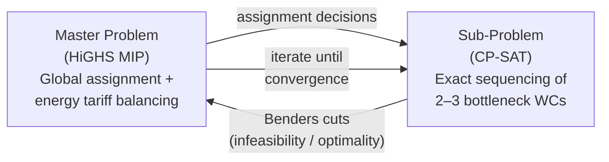

# 03 — Hybrid Solver Portfolio

> **Scope**: Six-layer solver architecture, dispatch regimes, LBBD decomposition, ML advisory surfaces, XAI contract, and model governance.

<details><summary>🇷🇺 Краткое описание</summary>

Шестиуровневая архитектура решателей: от жадных эвристик (миллисекунды) до точных CP-SAT решателей (секунды-минуты). Портфель автоматически выбирает стратегию в зависимости от режима (штатный/авария/срочный заказ). Logic-Based Benders Decomposition (LBBD) разделяет глобальное назначение (MIP) и точное секвенсирование узких горлышек (CP-SAT). Графовые нейросети (HGAT) предсказывают оптимальные веса до запуска решателя. Все ML-модели — советники, не исполнители.
</details>

---

## 1. Architectural Principle: Deterministic Core + ML Advisory

```
┌─────────────────────────────────────────────────┐
│                  Human Override                  │
│           (dispatcher confirms / edits)          │
├─────────────────────────────────────────────────┤
│              XAI Explanation Layer               │
│   (SHAP values, constraint provenance, diffs)   │
├─────────────────────────────────────────────────┤
│             ML Advisory (GNN + RL)              │
│  (weight prediction, dispatch hints, Q-tuning)  │
├─────────────────────────────────────────────────┤
│           Incremental Repair Engine             │
│    (local subgraph repair, freeze unaffected)   │
├─────────────────────────────────────────────────┤
│              Exact Solver Layer                  │
│     (CP-SAT for bottlenecks, HiGHS for MIP)    │
├─────────────────────────────────────────────────┤
│          Constructive Heuristic Layer           │
│      (GREED/ATCS dispatching, O(n log n))       │
└─────────────────────────────────────────────────┘
```

**Iron rule**: ML models _advise_, deterministic solvers _execute_. No ML output bypasses the feasibility checker. Human override is always the final authority.

---

## 2. Solver Portfolio — Dispatch Regimes

The **Solver Router** selects the solving strategy based on the operational context. Each regime trades off solution quality against latency.

| Regime | Trigger | Solver Chain | Latency | Quality |
|--------|---------|-------------|---------|---------|
| **NOMINAL** | Nightly / shift boundary | GREED → CP-SAT (bottlenecks) → NSGA-III polish | 30–120 s | ★★★★★ |
| **RUSH_ORDER** | Priority order injection | Freeze unaffected → Incremental Repair → CP-SAT patch | 5–15 s | ★★★★ |
| **BREAKDOWN** | Machine failure event | Affected subgraph isolation → Greedy reallocation → Repair | 2–5 s | ★★★ |
| **MATERIAL_SHORTAGE** | Inventory alarm | Constraint tightening → Re-solve affected ops | 10–30 s | ★★★★ |
| **INTERACTIVE** | Operator drag-and-drop | Feasibility check → local optimization → diff | < 1 s | ★★★ |
| **WHAT_IF** | Scenario analysis (DES) | Full solve with modified parameters, no commit | 30–300 s | ★★★★★ |

---

## 3. Logic-Based Benders Decomposition (LBBD)

Greedy heuristics based on priority rules (ATCS) are blind to bottlenecks. LBBD splits the problem into two cooperating layers:



### Master Problem (Global Assignment)
- **Solver**: HiGHS v1.8+ (LP/MIP)
- **Decides**: Operation → WorkCenter assignment, shift allocation, energy tariff windows
- **Objective**: Minimize total load imbalance across work centers + energy cost
- **Scale**: All $N$ operations, all $M$ work centers — but relaxed (no sequencing detail)

### Sub-Problem (Bottleneck Sequencing)
- **Solver**: Google OR-Tools CP-SAT v9.10+
- **Decides**: Exact operation order on 2–3 bottleneck work centers
- **Constraints**: `NO_OVERLAP` intervals with SDST transition matrix, auxiliary resource capacity
- **Complexity reduction**: From $O((M!)^N)$ for the full operating network to solvable clusters of 50–200 operations

### Benders Cut Protocol
1. Master produces global assignment
2. Sub-problem attempts exact sequencing on bottleneck WCs
3. If infeasible → sub-problem generates a **no-good cut** (Benders cut) sent back to Master
4. If feasible but suboptimal → **capacity cuts** (Hooker & Ottosson 2003) tighten the makespan lower bound on the bottleneck machine
5. **Load-balance cuts** enforce `C_max ≥ total_processing / num_machines` as a relaxation-free bound
6. Master re-solves with additional constraints
7. Iterate until convergence (typically 3–8 iterations, 1% optimality gap)

> **Implemented status (2026-04)**: `LBBD-5` and `LBBD-10` profiles ship with HiGHS master, CP-SAT subproblems, no-good + capacity + load-balance cuts. Verified on `medium_stress_20x4.json` (181 min LBBD vs 289 min GREED). See `synaps/solvers/lbbd_solver.py`.

---

## 4. Constructive Heuristic: GREED / ATCS Dispatch

For the initial schedule and non-bottleneck work centers, the system uses an Apparent Tardiness Cost with Setups (ATCS) composite priority rule (Lee, Bhaskaran & Pinedo 1997):

$$I_j = \frac{w_j}{p_j} \cdot \exp\!\Bigl(-\frac{\max(d_j - p_j - t, 0)}{K_1 \bar{p}}\Bigr) \cdot \exp\!\Bigl(-\frac{s_{lj}}{K_2 \bar{s}}\Bigr)$$

Where:
- $w_j$ — job weight (priority)
- $p_j$ — processing time
- $d_j$ — due date
- $t$ — current time
- $s_{lj}$ — setup time from last completed job $l$ to candidate $j$
- $K_1, K_2$ — look-ahead parameters (tuned by GNN or historical replay)
- $\bar{p}, \bar{s}$ — average processing time and average setup time

**Properties**: $O(n \log n)$ per dispatch step, deterministic, explainable, produces feasible schedules immediately. Serves as warm-start for exact solvers.

> **Implemented status (2026-04)**: Log-space ATCS scoring (avoids float underflow), queue-local setup scale, speed-factor-aware durations. See `synaps/solvers/greedy_dispatch.py`.

---

## 5. Incremental Repair Engine

When disruptions occur (machine breakdown, rush order, material shortage), the system avoids full re-planning:

```
1. DETECT   → Event triggers repair (breakdown, rush order, delay)
2. ISOLATE  → Identify affected subgraph (operations + dependencies)
3. FREEZE   → Lock all unaffected assignments (stability guarantee)
4. REPAIR   → Re-solve only the affected subgraph (CP-SAT or greedy)
5. DIFF     → Generate human-readable diff (moved operations, new times)
6. APPROVE  → Dispatcher confirms or edits (XAI layer shows "why")
7. COMMIT   → Publish schedule delta via event store
```

### Repair Radius Policy

| Disruption Type | Typical Radius | Strategy |
|----------------|---------------|----------|
| Single machine breakdown | 1-hop neighbors | Greedy reallocation |
| Rush order injection | Affected WC + downstream | CP-SAT on subgraph |
| Material shortage | All ops requiring material | Constraint tightening + greedy |
| Quality hold | Batch + successor ops | Freeze + reschedule successors |

> **Implemented status (2026-04)**: `IncrementalRepair` engine with priority-aware greedy redispatch, correct per-order tardiness computation, and post-hoc setup recomputation. Horizon-bound validation added to `FeasibilityChecker`. See `synaps/solvers/incremental_repair.py`, `synaps/solvers/feasibility_checker.py`.

**Stability metric**: $\text{Nervousness} = \frac{|\text{moved operations}|}{|\text{total operations}|}$ — target $< 5\%$ per repair cycle.

---

## 6. GNN Weight Predictor (ML Advisory Surface)

A Heterogeneous Graph Attention Network (HGAT) predicts optimal solver parameters _before_ the solver runs.

### Graph Encoding

The operating network is encoded as a heterogeneous graph $G = (V, E)$:

| Node Type | Features | Count |
|-----------|----------|-------|
| **Operation** | processing time, due date, priority, state attributes | $N$ (thousands) |
| **WorkCenter** | capacity, speed factor, current utilization | $M$ (tens–hundreds) |
| **AuxResource** | pool size, current availability | $A$ (tens) |

| Edge Type | Semantics |
|-----------|-----------|
| Operation → WorkCenter | "can be processed on" (eligibility) |
| Operation → Operation | "must precede" (precedence DAG) |
| Operation → AuxResource | "requires" (auxiliary resource need) |
| WorkCenter → WorkCenter | "shares setup crew" (coupled transitions) |

### Architecture

```python
# PyTorch Geometric — Heterogeneous GAT
class SchedulingGraphEncoder(torch.nn.Module):
    def __init__(self, hidden: int = 256, heads: int = 4):
        super().__init__()
        self.conv1 = HeteroConv({
            ('operation', 'runs_on', 'workcenter'): GATv2Conv((-1, -1), hidden, heads=heads),
            ('operation', 'precedes', 'operation'): GATv2Conv((-1, -1), hidden, heads=heads),
            ('operation', 'requires', 'aux_resource'): GATv2Conv((-1, -1), hidden, heads=heads),
        }, aggr='mean')
        self.conv2 = HeteroConv({...}, aggr='mean')  # second message-passing layer

class WeightPredictor(torch.nn.Module):
    """Predicts ATCS look-ahead parameters K1, K2 and objective weights Q."""
    def __init__(self, encoder: SchedulingGraphEncoder):
        super().__init__()
        self.encoder = encoder
        self.head = MLP([256, 128, 8])  # 6 weights Q_i + K1 + K2

    def forward(self, batch: HeteroData) -> Tensor:
        z = self.encoder(batch)                    # graph embedding
        pooled = global_mean_pool(z['operation'])  # aggregate
        return self.head(pooled)                   # [Q1..Q6, K1, K2]
```

### Five ML Advisory Surfaces

| Surface | Input | Output | Consumer |
|---------|-------|--------|----------|
| **Weight Predictor** | Operating graph state | Objective weights $Q_i$, ATCS params $K_1, K_2$ | GREED heuristic, NSGA-III |
| **Bottleneck Detector** | Utilization + queue depths | Top-K bottleneck WC IDs | LBBD sub-problem selection |
| **Setup Aggregator** | Order features + SDST matrix | Recommended batching groups | Pre-processing step |
| **Duration Estimator** | Historical + state attributes | Predicted $p_j$ per operation-WC pair | All solvers |
| **Disruption Classifier** | Sensor telemetry stream | Disruption type + severity | Repair engine trigger |

---

## 7. Model Governance & Promotion Gates

ML models follow a strict promotion pipeline. No model reaches production without passing all gates.

| Gate | Criteria | Evidence |
|------|----------|----------|
| **G1: Replay Corpus** | Model improves KPIs on historical replay dataset (≥1000 schedules) | Replay report with before/after metrics |
| **G2: Shadow Mode** | Model runs alongside production, predictions logged but not acted upon | 7-day shadow log analysis, no regression |
| **G3: Canary Deployment** | Model advises on 5% of decisions, fallback to heuristic baseline | A/B comparison, statistical significance |
| **G4: Production** | Full advisory deployment | Continuous drift monitoring via MLflow |
| **G5: Rollback** | Automatic rollback if any KPI degrades > 2% over 24-hour window | Alerting pipeline trigger |

**Registry**: All model artifacts tracked in MLflow (self-hosted). Each model version has: training data hash, hyperparameters, replay corpus metrics, promotion history.

---

## 8. XAI Contract — Explainability Requirements

Every scheduling decision must be explainable to a human operator:

| Decision Type | Explanation Format | Example |
|--------------|-------------------|---------|
| **Operation assignment** | "Assigned to WC-5 because: shortest setup from previous job (12 min vs 45 min on WC-3)" | SHAP feature attribution |
| **Sequence change** | Diff view: "Operations A, B swapped to reduce total tardiness by 2.3 hours" | Before/after Gantt comparison |
| **Repair action** | "Machine M-7 breakdown → 3 operations moved to M-12 (same capability group, +8 min total)" | Constraint provenance chain |
| **Weight adjustment** | "GNN predicted Q₃ (material loss) increased 40% due to high raw material cost this week" | Weight change log + reasoning |

**Rule**: If the XAI layer cannot produce an explanation, the decision is rejected and falls back to the previous known-good schedule.

---

## 8.1 Execution Language Boundary

The solver portfolio is intentionally polyglot:

1. control-plane orchestration and operator-facing APIs belong outside the hot path;
2. Python remains the canonical proof surface for exact solving and ML advisory;
3. Rust is the target for measured hot-path kernels such as feasibility and ALNS operators.

See [Language & Runtime Strategy](06_LANGUAGE_AND_RUNTIME_STRATEGY.md) for the explicit boundary contract.

---

## 9. Solver Interface Specification (Target: Rust)

The production solver targets a Rust implementation for performance and safety. Python prototype mirrors these interfaces:

```rust
/// Core solver trait — all solvers implement this
pub trait ScheduleSolver {
    fn solve(&self, problem: &Problem, params: &SolverParams) -> Result<Solution, SolverError>;
    fn name(&self) -> &str;
    fn supports_incremental(&self) -> bool;
}

/// Feasibility verification — separate from solving
pub trait FeasibilityEngine {
    fn check(&self, solution: &Solution, problem: &Problem) -> Vec<Violation>;
    fn is_feasible(&self, solution: &Solution, problem: &Problem) -> bool;
}

/// Repair engine — incremental schedule repair
pub trait RepairEngine {
    fn repair(
        &self,
        current: &Solution,
        disruption: &Disruption,
        problem: &Problem,
    ) -> Result<RepairDelta, RepairError>;
}
```

---

## 10. Determinism & Replay Budget

All solvers must be **deterministic** given the same input:

| Component | Determinism Guarantee |
|-----------|----------------------|
| GREED/ATCS heuristic | Fully deterministic (same seed → same output) |
| CP-SAT | Deterministic with `num_workers=1` and fixed seed |
| HiGHS MIP | Deterministic with single thread + fixed seed |
| NSGA-III | Deterministic with fixed random seed |
| GNN inference | Deterministic (PyTorch `torch.use_deterministic_algorithms(True)`) |

**Replay harness**: Every schedule run is logged with full input snapshot (problem state, solver params, random seed). Any historical schedule can be exactly reproduced for audit and debugging.

---

## References

- Ozolins, E. (2023). Improved ATCS Rules for FJSP with SDST. *European Journal of Operational Research*.
- Ku, W.-Y. & Beck, J.C. (2016). Mixed Integer Programming Models for JSSP. *Computers & Operations Research*.
- Park, J. et al. (2021). Learning to Schedule with GNNs. *NeurIPS*.
- Deb, K. & Jain, H. (2014). NSGA-III for Many-Objective Optimization. *IEEE Transactions on Evolutionary Computation*.
- Hooker, J.N. & Ottosson, G. (2003). Logic-Based Benders Decomposition. *Mathematical Programming*.
