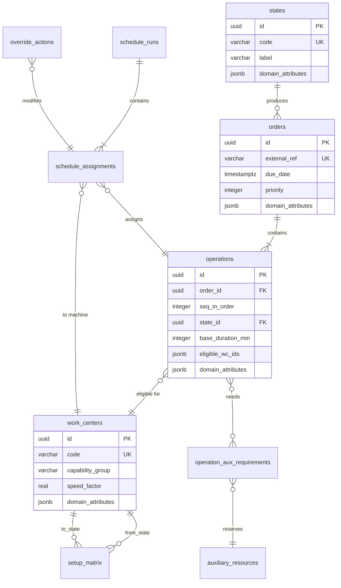

# 04 — Universal Data Model

> **Scope**: Canonical entities, SQL DDL (PostgreSQL 17+), JSONB domain parametrization, event model, stream topology, and partitioning strategy.

<details><summary>🇷🇺 Краткое описание</summary>

Универсальная модель данных на PostgreSQL 17+. Десять таблиц покрывают полный цикл: состояния продукции, заказы, операции, рабочие центры, матрица переналадок (SDST), вспомогательные ресурсы, расписания и действия оператора. Поле `domain_attributes JSONB` параметризует схему под любую отрасль (металлургия, фарма, электроника, ЦОД и т.д.) без изменения DDL. Событийная модель — Outbox + NATS JetStream 2.12+ — обеспечивает exactly-once доставку.
</details>

---

## 1. Entity-Relationship Diagram



---

## 2. DDL — Core Tables

> Full split DDL files are in [`schema/ddl/`](../../schema/ddl/).

### 2.1 States & Orders

```sql
-- schema/ddl/001_core_tables.sql
CREATE TABLE states (
    id              UUID PRIMARY KEY DEFAULT gen_random_uuid(),
    code            VARCHAR(80) NOT NULL UNIQUE,
    label           VARCHAR(200),
    domain_attributes JSONB NOT NULL DEFAULT '{}'
);

CREATE TABLE orders (
    id              UUID PRIMARY KEY DEFAULT gen_random_uuid(),
    external_ref    VARCHAR(120) NOT NULL UNIQUE,
    due_date        TIMESTAMPTZ NOT NULL,
    priority        INTEGER NOT NULL DEFAULT 500,
    quantity         NUMERIC(12,3) NOT NULL DEFAULT 1,
    unit            VARCHAR(20) NOT NULL DEFAULT 'pcs',
    domain_attributes JSONB NOT NULL DEFAULT '{}'
);

CREATE TABLE operations (
    id              UUID PRIMARY KEY DEFAULT gen_random_uuid(),
    order_id        UUID NOT NULL REFERENCES orders(id),
    seq_in_order    INTEGER NOT NULL,
    state_id        UUID NOT NULL REFERENCES states(id),
    base_duration_min INTEGER NOT NULL,
    eligible_wc_ids JSONB NOT NULL DEFAULT '[]',
    predecessor_op_id UUID REFERENCES operations(id),
    domain_attributes JSONB NOT NULL DEFAULT '{}',
    UNIQUE (order_id, seq_in_order)
);

CREATE TABLE work_centers (
    id              UUID PRIMARY KEY DEFAULT gen_random_uuid(),
    code            VARCHAR(60) NOT NULL UNIQUE,
    capability_group VARCHAR(60) NOT NULL,
    speed_factor    REAL NOT NULL DEFAULT 1.0,
    max_parallel    INTEGER NOT NULL DEFAULT 1,
    domain_attributes JSONB NOT NULL DEFAULT '{}'
);
```

  `seq_in_order` is the canonical linear order inside an order. Runtime validation auto-fills `predecessor_op_id` from that order when it is omitted, and explicit `predecessor_op_id` values must match the same-order chain. Cross-order predecessors are rejected.

### 2.2 Setup Matrix (SDST Graph)

```sql
-- schema/ddl/002_setup_matrix.sql
CREATE TABLE setup_matrix (
    id              UUID PRIMARY KEY DEFAULT gen_random_uuid(),
    work_center_id  UUID NOT NULL REFERENCES work_centers(id),
    from_state_id   UUID NOT NULL REFERENCES states(id),
    to_state_id     UUID NOT NULL REFERENCES states(id),
    setup_minutes   INTEGER NOT NULL,
    material_loss   NUMERIC(10,3) NOT NULL DEFAULT 0,
    energy_kwh      NUMERIC(10,3) NOT NULL DEFAULT 0,
    domain_attributes JSONB NOT NULL DEFAULT '{}',
    UNIQUE (work_center_id, from_state_id, to_state_id)
);
```

### 2.3 Auxiliary Resources

```sql
-- schema/ddl/003_auxiliary_resources.sql
CREATE TABLE auxiliary_resources (
    id              UUID PRIMARY KEY DEFAULT gen_random_uuid(),
    code            VARCHAR(60) NOT NULL UNIQUE,
    resource_type   VARCHAR(40) NOT NULL,
    pool_size       INTEGER NOT NULL DEFAULT 1,
    domain_attributes JSONB NOT NULL DEFAULT '{}'
);

CREATE TABLE operation_aux_requirements (
    id              UUID PRIMARY KEY DEFAULT gen_random_uuid(),
    operation_id    UUID NOT NULL REFERENCES operations(id),
    aux_resource_id UUID NOT NULL REFERENCES auxiliary_resources(id),
    quantity_needed INTEGER NOT NULL DEFAULT 1,
    UNIQUE (operation_id, aux_resource_id)
);
```

  Auxiliary-resource reservations apply to the setup window immediately preceding an operation as well as to the processing interval itself. This keeps the constructive heuristics, feasibility checker, and CP-SAT model aligned on the same physical contract.

### 2.4 Scheduling Results

```sql
-- schema/ddl/004_scheduling.sql
CREATE TABLE schedule_runs (
    id              UUID PRIMARY KEY DEFAULT gen_random_uuid(),
    created_at      TIMESTAMPTZ NOT NULL DEFAULT now(),
    solver_name     VARCHAR(60) NOT NULL,
    solver_params   JSONB NOT NULL DEFAULT '{}',
    status          VARCHAR(20) NOT NULL DEFAULT 'draft',
    objective_value JSONB,
    duration_ms     INTEGER,
    random_seed     BIGINT
);

CREATE TABLE schedule_assignments (
    id              UUID PRIMARY KEY DEFAULT gen_random_uuid(),
    run_id          UUID NOT NULL REFERENCES schedule_runs(id),
    operation_id    UUID NOT NULL REFERENCES operations(id),
    work_center_id  UUID NOT NULL REFERENCES work_centers(id),
    start_time      TIMESTAMPTZ NOT NULL,
    end_time        TIMESTAMPTZ NOT NULL,
    setup_minutes   INTEGER NOT NULL DEFAULT 0,
    aux_resource_ids JSONB NOT NULL DEFAULT '[]'
);

CREATE TABLE override_actions (
    id              UUID PRIMARY KEY DEFAULT gen_random_uuid(),
    assignment_id   UUID NOT NULL REFERENCES schedule_assignments(id),
    action_type     VARCHAR(40) NOT NULL,
    operator_id     VARCHAR(120),
    reason          TEXT,
    previous_value  JSONB,
    new_value       JSONB,
    created_at      TIMESTAMPTZ NOT NULL DEFAULT now()
);
```

### 2.5 Indexes

```sql
-- schema/ddl/005_indexes.sql
CREATE INDEX idx_operations_order       ON operations (order_id);
CREATE INDEX idx_operations_state       ON operations (state_id);
CREATE INDEX idx_operations_predecessor ON operations (predecessor_op_id);
CREATE INDEX idx_setup_wc_from_to       ON setup_matrix (work_center_id, from_state_id, to_state_id);
CREATE INDEX idx_setup_wc              ON setup_matrix (work_center_id);
CREATE INDEX idx_aux_req_operation      ON operation_aux_requirements (operation_id);
CREATE INDEX idx_aux_req_resource       ON operation_aux_requirements (aux_resource_id);
CREATE INDEX idx_assignments_run        ON schedule_assignments (run_id);
CREATE INDEX idx_assignments_operation  ON schedule_assignments (operation_id);
CREATE INDEX idx_assignments_wc         ON schedule_assignments (work_center_id);
CREATE INDEX idx_assignments_time       ON schedule_assignments (start_time, end_time);
CREATE INDEX idx_overrides_assignment   ON override_actions (assignment_id);
```

---

## 3. JSONB Domain Parametrization

The `domain_attributes` field in every core table enables industry-specific extensions without DDL changes.

### 3.1 Metallurgy Example

```json
{
  "state": {
    "alloy_grade": "AISI-304",
    "temperature_celsius": 1450,
    "cross_section_mm": 120
  },
  "setup_matrix": {
    "requires_furnace_purge": true,
    "purge_gas": "argon",
    "cooldown_minutes": 45
  }
}
```

### 3.2 Pharmaceutical Example

```json
{
  "state": {
    "api_compound": "Amoxicillin",
    "gxp_class": "EU-GMP-Annex1",
    "allergen_group": "penicillin"
  },
  "setup_matrix": {
    "cip_protocol": "CIP-SIP-3cycle",
    "validation_required": true,
    "hold_time_max_hours": 4
  }
}
```

### 3.3 Data Center Example

```json
{
  "state": {
    "workload_type": "GPU-training",
    "gpu_model": "H100",
    "vram_gb": 80
  },
  "work_center": {
    "rack_id": "DC2-R14",
    "power_budget_kw": 12.5,
    "cooling_zone": "liquid"
  }
}
```

---

## 4. ORM Compatibility

| Feature | PostgreSQL Native | SQLAlchemy | Prisma | TypeORM |
|---------|-------------------|-----------|--------|---------|
| UUID PK | `gen_random_uuid()` | `Column(UUID)` | `@id @default(uuid())` | `@PrimaryGeneratedColumn('uuid')` |
| JSONB querying | `->`, `->>`, `@>` | `column['key']` | `Json` type | `jsonb` column |
| UNIQUE constraints | `UNIQUE (a, b)` | `UniqueConstraint` | `@@unique([a, b])` | `@Unique` |
| Timestamp with TZ | `TIMESTAMPTZ` | `DateTime(timezone=True)` | `DateTime` | `timestamp with time zone` |
| Enums | `VARCHAR` + app validation | Enum type | `enum` | `enum` |

**Recommendation**: Use JSONB for domain attributes instead of EAV (Entity-Attribute-Value) tables. JSONB supports GIN indexing for fast `@>` containment queries and is natively supported by PostgreSQL 17+.

---

## 5. Event Model

All state changes are published as events through an **Outbox** pattern:

### 5.1 Event Envelope

```json
{
  "event_id": "evt_01HWXYZ...",
  "event_type": "schedule.assignment.created",
  "version": "1.0",
  "timestamp": "2026-04-01T08:30:00Z",
  "correlation_id": "run_01HWABC...",
  "aggregate_type": "schedule_run",
  "aggregate_id": "run_01HWABC...",
  "payload": {
    "operation_id": "op_01HW...",
    "work_center_id": "wc_01HW...",
    "start_time": "2026-04-01T14:00:00Z",
    "end_time": "2026-04-01T15:30:00Z"
  }
}
```

### 5.2 Event Types

| Event | Trigger | Consumers |
|-------|---------|-----------|
| `schedule.run.started` | Solver invocation | Dashboard, audit log |
| `schedule.run.completed` | Solver finishes | Dashboard, notification service |
| `schedule.assignment.created` | New assignment in run | Gantt renderer, MES bridge |
| `schedule.assignment.modified` | Override action | Audit log, XAI layer |
| `disruption.detected` | Sensor / MES alarm | Repair engine trigger |
| `disruption.resolved` | Repair completed | Dashboard, notification |

---

## 6. Stream Topology (NATS JetStream 2.12+)

```
STREAM: scheduling
├── scheduling.runs.>          (schedule lifecycle)
├── scheduling.assignments.>   (individual assignments)
├── scheduling.overrides.>     (human override actions)
└── scheduling.disruptions.>   (disruption events)

STREAM: telemetry
├── telemetry.wc.{wc_id}.>    (work center sensors)
└── telemetry.aux.{res_id}.>  (auxiliary resource sensors)

STREAM: ml
├── ml.predictions.>           (GNN / RL model outputs)
└── ml.promotions.>            (model lifecycle events)
```

**Retention**: `scheduling` stream — 90 days (regulatory audit). `telemetry` — 30 days (high volume, archived to ClickHouse). `ml` — 180 days (model provenance).

---

## 7. Partitioning Strategy

| Table | Partition Key | Strategy | Rationale |
|-------|--------------|----------|-----------|
| `schedule_assignments` | `start_time` | Range (monthly) | Query pattern: "show assignments for this week" |
| `override_actions` | `created_at` | Range (monthly) | Audit trail, time-based queries |
| `setup_matrix` | — | None (static, < 100K rows) | Fits in shared_buffers |
| `operations` | — | None (bulk-loaded per planning horizon) | Refreshed each cycle |

**Archive policy**: Partitions older than 12 months are detached and moved to cold storage (compressed, read-only tablespace or exported to Parquet).

---

## References

- PostgreSQL 18 Documentation — JSONB Indexing, HNSW Vector Search.
- Kleppmann, M. (2017). *Designing Data-Intensive Applications*. O'Reilly.
- Fowler, M. (2005). Event Sourcing Pattern. martinfowler.com.
