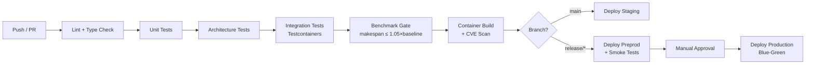

# 05 — Deployment & Operations

> **Scope**: Environments, platform Bill of Materials, air-gapped deployment, CI/CD, security model, performance budgets, SLO classes, degraded modes, and observability stack.

<details><summary>🇷🇺 Краткое описание</summary>

Модель развёртывания Syn-APS: четыре среды (dev — prod), полный BOM платформы (PostgreSQL 18, NATS JetStream 2.11, SGLang, PyTorch 2.6, OR-Tools CP-SAT v9.10+), изолированный (air-gapped) режим с оффлайн-артефактным пайплайном, трёхзонная модель безопасности (DMZ → App → Data), шесть канонических ролей RBAC, три класса SLO и стек наблюдаемости (Prometheus + Grafana + OpenTelemetry + ClickHouse). Все компоненты совместимы с OCI-контейнеризацией и Helm-чартами.
</details>

---

## 1. Environment Matrix

| Environment | Purpose | Infra | Data | Solvers |
|-------------|---------|-------|------|---------|
| **dev** | Local development | Docker Compose | Synthetic fixtures | Greedy only |
| **staging** | Integration testing | Kubernetes (single node) | Anonymized production snapshot | All solvers |
| **preprod** | UAT & performance benchmarks | Kubernetes (3-node) | Shadow production | All solvers + ML models |
| **prod** | Live operations | Kubernetes (HA) | Production | All solvers + promoted ML |

---

## 2. Platform Bill of Materials (BOM)

| Component | Version | Role | Licence |
|-----------|---------|------|---------|
| PostgreSQL | 18+ | RDBMS, event store, HNSW vector search | PostgreSQL License |
| NATS JetStream | 2.11+ | Event streaming, exactly-once delivery | Apache-2.0 |
| OR-Tools CP-SAT | 9.10+ | Constraint programming solver | Apache-2.0 |
| HiGHS | 1.8+ | LP/MIP solver (LBBD master) | MIT |
| Python | 3.12+ | Solver engine, ML pipelines | PSF License |
| PyTorch | 2.6+ | ML training (Inductor compiler) | BSD-3 |
| PyTorch Geometric | 2.6+ | GNN – HGAT weight predictor | MIT |
| TorchRL | 0.6+ | Reinforcement learning (Digital Twin) | MIT |
| SGLang | 0.4+ | LLM inference runtime | Apache-2.0 |
| ExecuTorch | 0.5+ | Edge AI on ARM PLCs/gateways | BSD-3 |
| FastAPI | 0.115+ | REST / WebSocket API | MIT |
| Redis | 7.4+ | Cache, session, rate limiting | BSD-3 |
| Prometheus | 2.55+ | Metrics collection | Apache-2.0 |
| Grafana | 11+ | Dashboards & alerting | AGPL-3.0 |
| OpenTelemetry | 1.30+ | Distributed tracing | Apache-2.0 |
| ClickHouse | 24+ | Telemetry archive, analytics | Apache-2.0 |
| Helm | 3.16+ | Kubernetes package management | Apache-2.0 |
| Trivy / Grype | latest | Container vulnerability scanning | Apache-2.0 |

---

## 3. Platform Topology

```
                  ┌─────────────────────────────────────┐
                  │            Load Balancer             │
                  │         (TLS termination)            │
                  └───────────────┬─────────────────────┘
                                  │
                ┌─────────────────┼─────────────────────┐
                │                 │                      │
        ┌───────▼───────┐ ┌──────▼──────┐ ┌────────────▼───────┐
        │  API Gateway  │ │  WebSocket  │ │   Grafana / UI     │
        │  (FastAPI)    │ │  Server     │ │   (read-only)      │
        └───────┬───────┘ └──────┬──────┘ └────────────────────┘
                │                │
        ┌───────▼────────────────▼──────┐
        │       Application Layer       │
        │  ┌──────────┐ ┌───────────┐   │
        │  │ Schedule  │ │ Repair    │   │
        │  │ Service   │ │ Engine    │   │
        │  └─────┬─────┘ └─────┬────┘   │
        │        │              │        │
        │  ┌─────▼──────────────▼────┐   │
        │  │    Solver Orchestrator  │   │
        │  │  CP-SAT · HiGHS · LBBD │   │
        │  └────────────┬────────────┘   │
        └───────────────┼────────────────┘
                        │
        ┌───────────────┼────────────────┐
        │               │                │
  ┌─────▼─────┐  ┌──────▼──────┐  ┌─────▼──────┐
  │ PostgreSQL │  │    NATS     │  │   Redis    │
  │    18      │  │ JetStream   │  │   7.4+     │
  │  (primary  │  │   2.11      │  │  (cache)   │
  │  + replica)│  └─────────────┘  └────────────┘
  └────────────┘
```

---

## 4. Air-Gapped Deployment

For environments with no internet access (defense, critical infrastructure, secure manufacturing), Syn-APS supports fully offline deployment.

### 4.1 Artifact Pipeline

```
Build Host (online)                    Transfer Medium              Target (air-gapped)
┌─────────────────┐                   ┌────────────┐              ┌──────────────────┐
│ OCI registry    │ ─── crane export  │  Encrypted │ ── crane    │ Local OCI        │
│ build + sign    │     + checksums ──│  USB / DVD │    import ──│ registry (Harbor)│
│ SBOM generate   │                   │  or tape   │             │ signature verify │
│ CVE scan        │                   └────────────┘             │ SBOM audit       │
└─────────────────┘                                              └──────────────────┘
```

### 4.2 Offline Requirements

| Concern | Solution |
|---------|----------|
| Container images | Pre-built, signed OCI images exported via `crane` |
| Python packages | `pip download` → vendored wheel archive |
| ML model weights | Serialized `.pt` / `.onnx` bundles with SHA-256 manifest |
| System clock | NTP via local Stratum-1 GPS clock or manual sync |
| Certificate authority | Internal PKI with short-lived certificates (cert-manager) |
| OS patches | Pre-tested RPM/DEB snapshots transferred on schedule |

### 4.3 Supply Chain Verification

```bash
# Build host: sign and generate SBOM
cosign sign --key cosign.key $IMAGE_REF
syft $IMAGE_REF -o spdx-json > sbom.spdx.json
grype sbom:sbom.spdx.json --fail-on critical

# Target host: verify before deploy
cosign verify --key cosign.pub $IMAGE_REF
grype sbom:sbom.spdx.json --fail-on critical
```

---

## 5. CI/CD Pipeline



### 5.1 Quality Gates

| Gate | Criteria | Blocks Deploy? |
|------|----------|---------------|
| Lint | `ruff check` + `mypy --strict` | Yes |
| Unit tests | 100% pass, coverage ≥ 80% | Yes |
| Architecture tests | Zero layer violations | Yes |
| Integration tests | All Testcontainers pass | Yes |
| Benchmark gate | Makespan ≤ 1.05× baseline for reference dataset | Yes (staging+) |
| CVE scan | 0 critical, 0 high (unfixed) | Yes |
| SBOM | Generated and attached to release | Yes (release) |

---

## 6. Security Model

### 6.1 Trust Zones

```
┌──────────────────────────────────────────────────────┐
│  Zone 0: DMZ                                         │
│  ┌────────────────────────────────────────────────┐  │
│  │  Load Balancer · WAF · Rate Limiter            │  │
│  └───────────────────────┬────────────────────────┘  │
│                          │ mTLS                      │
│  Zone 1: Application     │                           │
│  ┌───────────────────────▼────────────────────────┐  │
│  │  API Gateway · Schedule Service · Repair Engine│  │
│  │  Solver Orchestrator · ML Inference            │  │
│  └───────────────────────┬────────────────────────┘  │
│                          │ mTLS / Unix socket        │
│  Zone 2: Data            │                           │
│  ┌───────────────────────▼────────────────────────┐  │
│  │  PostgreSQL 18 · NATS JetStream · Redis        │  │
│  │  ClickHouse (telemetry archive)                │  │
│  └────────────────────────────────────────────────┘  │
└──────────────────────────────────────────────────────┘
```

### 6.2 Identity & Authorization

| Method | Scope |
|--------|-------|
| OAuth2 / OIDC | Human users (SSO integration) |
| mTLS | Service-to-service |
| API Keys + HMAC | External MES / ERP integration |
| JWT (short-lived) | Session tokens |

### 6.3 RBAC — Canonical Roles

| Role | Permissions | Typical User |
|------|-------------|-------------|
| `viewer` | Read schedules, dashboards | Shift supervisor |
| `planner` | Create/modify schedule runs, view models | Production planner |
| `operator` | Override assignments, log disruptions | Machine operator |
| `engineer` | Manage work centers, setup matrix, aux resources | Process engineer |
| `ml_admin` | Promote/retire ML models, view training logs | Data scientist |
| `admin` | Full access, manage roles, audit log | System administrator |

### 6.4 Audit Model

Every state-changing action produces an audit event:

```json
{
  "audit_id": "aud_01HW...",
  "timestamp": "2026-04-01T08:30:00Z",
  "actor": { "type": "user", "id": "usr_01HW...", "role": "planner" },
  "action": "schedule.run.create",
  "resource": { "type": "schedule_run", "id": "run_01HW..." },
  "context": { "ip": "10.0.1.42", "user_agent": "SynAPS-UI/1.0" },
  "outcome": "success"
}
```

Audit events are immutable and retained for 7 years (configurable per regulatory domain).

---

## 7. Performance Budgets

### 7.1 Latency Targets

| Operation | Target (p99) | Method |
|-----------|-------------|--------|
| Greedy dispatch (≤500 ops) | ≤ 200 ms | In-memory, single-pass |
| CP-SAT solve (≤2000 ops) | ≤ 30 s | Time-boxed, warm start |
| LBBD solve (≤5000 ops) | ≤ 120 s | Iterative master-sub |
| Incremental repair (single disruption) | ≤ 2 s | Localized neighbourhood |
| GNN inference (weight prediction) | ≤ 50 ms | Batched, GPU optional |
| API response (read) | ≤ 50 ms | Redis cache + DB index |
| API response (write) | ≤ 200 ms | Async outbox commit |

### 7.2 Throughput

| Workload | Target |
|----------|--------|
| Concurrent planning sessions | ≥ 10 |
| Events per second (sustained) | ≥ 5,000 |
| Telemetry ingest | ≥ 50,000 points/s |
| WebSocket active connections | ≥ 1,000 |

---

## 8. SLO Classes

| Class | Availability | RTO | RPO | Use Case |
|-------|-------------|-----|-----|----------|
| **Tier 1 — Critical** | 99.9% | 5 min | 0 (sync replication) | Production scheduling, MES bridge |
| **Tier 2 — Standard** | 99.5% | 30 min | 5 min | Dashboards, what-if analysis |
| **Tier 3 — Best Effort** | 95% | 4 h | 1 h | ML training, batch analytics |

---

## 9. Degraded Mode Matrix

| Failure | Detection | Degraded Behavior | Recovery |
|---------|-----------|-------------------|----------|
| PostgreSQL primary down | pg_isready + replication lag | Promote replica; read-only until promotion | Automatic (Patroni / CloudNativePG) |
| NATS JetStream unavailable | Health probe timeout | Outbox retry queue; events buffered in PostgreSQL | Auto-reconnect + replay |
| Redis down | Connection timeout | Bypass cache; direct DB reads (higher latency) | Auto-reconnect |
| Solver timeout | Time-box exceeded | Return best-known solution + quality flag | Manual re-run with relaxed params |
| ML model service down | gRPC health check | Fall back to static weights (ATCS formula default) | Auto-restart + rollback to previous model |
| Disk full | OS alert threshold 85% | Stop accepting new schedule runs; read-only mode | Partition maintenance, archive old data |

---

## 10. Observability Stack

### 10.1 Metrics (Prometheus)

```yaml
# Key custom metrics
- synaps_schedule_run_duration_seconds     # histogram, by solver
- synaps_schedule_makespan_minutes         # gauge, latest run
- synaps_solver_iterations_total           # counter, by solver
- synaps_repair_invocations_total          # counter
- synaps_repair_radius_operations          # gauge, per repair
- synaps_disruption_events_total           # counter, by type
- synaps_gnn_inference_duration_seconds    # histogram
- synaps_outbox_pending_events             # gauge
- synaps_api_request_duration_seconds      # histogram, by endpoint
```

### 10.2 Tracing (OpenTelemetry)

Every schedule run creates a distributed trace:

```
Trace: schedule-run-01HW...
├── span: api.create_run (50ms)
├── span: solver.orchestrator.dispatch (2ms)
│   ├── span: solver.cpsat.solve (28.5s)
│   │   └── span: solver.cpsat.warm_start (200ms)
│   └── span: solver.objective.calculate (5ms)
├── span: persistence.save_assignments (120ms)
├── span: outbox.publish_events (15ms)
└── span: notification.send (8ms)
```

### 10.3 Logging

| Field | Source | Purpose |
|-------|--------|---------|
| `correlation_id` | API request / NATS message | End-to-end tracing |
| `schedule_run_id` | Solver context | Debugging solver behavior |
| `level` | Structured logger | Triage |
| `component` | Service / module name | Filtering |
| `duration_ms` | Instrumentation | Performance analysis |

**Log format**: JSON lines (structured), shipped to ELK or ClickHouse via Fluent Bit.

### 10.4 Dashboard Catalog

| Dashboard | Audience | Refresh |
|-----------|----------|---------|
| Production Overview | Plant manager | 10s |
| Solver Performance | Data scientist | 1m |
| Disruption Tracker | Shift supervisor | 5s |
| ML Model Registry | ML admin | 5m |
| Infrastructure Health | SRE / DevOps | 10s |
| Audit Trail | Compliance officer | 1m |

---

## 11. Helm Chart Structure

```
helm/syn-aps/
├── Chart.yaml
├── values.yaml
├── values-dev.yaml
├── values-staging.yaml
├── values-prod.yaml
├── values-airgap.yaml
├── templates/
│   ├── deployment-api.yaml
│   ├── deployment-solver.yaml
│   ├── deployment-ml.yaml
│   ├── statefulset-postgres.yaml
│   ├── statefulset-nats.yaml
│   ├── statefulset-redis.yaml
│   ├── service-*.yaml
│   ├── ingress.yaml
│   ├── configmap.yaml
│   ├── secret.yaml
│   ├── hpa.yaml
│   ├── pdb.yaml
│   └── tests/
│       ├── test-connection.yaml
│       └── test-solver-health.yaml
└── crds/
    └── (none — no custom CRDs required)
```

---

## References

- Burns, B. et al. (2018). *Kubernetes: Up and Running*. O'Reilly.
- Newman, S. (2021). *Building Microservices*, 2nd Ed. O'Reilly.
- NIST SP 800-190 — Application Container Security Guide.
- OpenTelemetry Specification v1.30.
