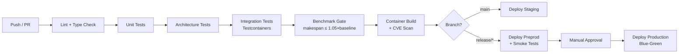

# 05 — Deployment & Operations

> **Scope**: current proof boundary plus the target deployment and operations model around the standalone SynAPS kernel.

<details><summary>🇷🇺 Краткое описание</summary>

Модель развёртывания SynAPS: текущая доказанная граница ограничена Python scheduling kernel, schema/contracts surfaces, benchmark harness и минимальным TypeScript Fastify BFF. Всё остальное в этом документе описывает целевую deployment architecture вокруг ядра: среды dev → prod, candidate BOM, air-gapped artifact pipeline, security zoning, SLO и observability.
</details>

---

## 0. Current Proof Boundary

The standalone repository currently proves a smaller runtime surface than the full deployment model described below:

1. the Python solver kernel and benchmark harness;
2. canonical schema and contract artifacts;
3. CLI/package execution helpers;
4. the minimal TypeScript Fastify BFF in `control-plane/`.

Everything else in this document should be read as target deployment architecture unless a section explicitly says otherwise.

---

## 1. Target Environment Matrix

These tiers describe the intended deployment progression around the current standalone kernel. The repository itself does not prove that staging, preprod, or prod environments below already exist.

| Environment | Purpose | Infra | Data | Solvers |
|-------------|---------|-------|------|---------|
| **dev** | Local development and contract testing | Local Python env + optional TypeScript BFF | Synthetic fixtures | Current standalone solver portfolio |
| **staging** | Target integration testing | Kubernetes (single node) | Anonymized production snapshot | Target deployed solver set |
| **preprod** | Target UAT and performance benchmarks | Kubernetes (3-node) | Shadow production | Target solver set + promoted advisory models |
| **prod** | Target live operations | Kubernetes (HA) | Production | Target solver set + promoted advisory models |

## 1.1 Zero-Touch Edge Posture

Industrial deployment pushes SynAPS toward a zero-touch operating model:

1. immutable, API-managed node images instead of mutable SSH-managed servers;
2. eBPF-first networking and kube-proxy replacement where latency matters;
3. durable workflow recovery for long-running optimization jobs;
4. declarative rollback and redeploy rather than node-by-node manual repair.

Version discipline matters.

As of `2026-04-02`, Kubernetes `1.35.x` is the latest stable minor release and `1.36` is still the upcoming release track. Treat `1.36` as target planning input, not as a currently shipped baseline.

---

## 2. Target Platform Bill of Materials (BOM)

The current repo-backed surfaces in this stack are the Python kernel, OR-Tools, HiGHS, schema/contracts artifacts, and the minimal Fastify + AJV BFF. The remaining entries are target deployment candidates, not shipped standalone dependencies.

| Component | Version | Role | Licence |
|-----------|---------|------|---------|
| PostgreSQL | 17+ | Current schema anchor; target transactional store and optional vector-search host (18 target) | PostgreSQL License |
| NATS JetStream (target) | 2.12+ | Durable event-streaming candidate around the kernel | Apache-2.0 |
| OR-Tools CP-SAT | 9.10+ | Constraint programming solver | Apache-2.0 |
| HiGHS | 1.8+ | LP/MIP solver (LBBD master) | MIT |
| Python | 3.13+ | Current solver engine; target ML orchestration host | PSF License |
| PyTorch (target ML stack) | 2.6+ | Future ML training and advisory experiments | BSD-3 |
| PyTorch Geometric (target) | 2.6+ | Future HGAT experiments | MIT |
| TorchRL (target) | 0.6+ | Future digital-twin RL research | MIT |
| SGLang (target) | 0.4+ | Future on-prem LLM inference candidate | Apache-2.0 |
| ExecuTorch (target) | 0.5+ | Future Edge AI export lane | BSD-3 |
| Fastify + AJV | 5.x | Current TypeScript BFF: REST boundary, schema validation, Python bridge | MIT |
| Valkey (target) | 9.0+ | Future cache, session, distributed-lock layer | BSD-3 |
| Prometheus (target observability) | 2.55+ | Metrics collection candidate | Apache-2.0 |
| Grafana (target observability) | 11+ | Dashboards and alerting candidate | AGPL-3.0 |
| OpenTelemetry (target observability) | 1.30+ | Distributed tracing candidate | Apache-2.0 |
| ClickHouse (target analytics plane) | 24+ | Telemetry archive and analytics candidate | Apache-2.0 |
| Helm (target deployment) | 3.16+ | Kubernetes package management candidate | Apache-2.0 |
| Trivy / Grype (target supply-chain lane) | latest | Container vulnerability scanning candidate | Apache-2.0 |

---

## 3. Target Platform Topology

```
                  ┌─────────────────────────────────────┐
                  │            Load Balancer             │
                  │         (TLS termination)            │
                  └───────────────┬─────────────────────┘
                                  │
                ┌─────────────────┼─────────────────────┐
                │                 │                      │
        ┌───────▼───────┐ ┌──────▼──────┐ ┌────────────▼───────┐
        │  API Gateway  │ │  WebSocket  │ │   Grafana / UI     │
        │ (Fastify BFF) │ │  Server     │ │   (read-only)      │
        └───────┬───────┘ └──────┬──────┘ └────────────────────┘
                │                │
        ┌───────▼────────────────▼──────┐
        │       Application Layer       │
        │  ┌──────────┐ ┌───────────┐   │
        │  │ Schedule  │ │ Repair    │   │
        │  │ Service   │ │ Engine    │   │
        │  └─────┬─────┘ └─────┬────┘   │
        │        │              │        │
        │  ┌─────▼──────────────▼────┐   │
        │  │    Solver Orchestrator  │   │
        │  │  CP-SAT · HiGHS · LBBD │   │
        │  └────────────┬────────────┘   │
        └───────────────┼────────────────┘
                        │
        ┌───────────────┼────────────────┐
        │               │                │
  ┌─────▼─────┐  ┌──────▼──────┐  ┌─────▼──────┐
  │ PostgreSQL │  │    NATS     │  │   Valkey   │
  │    17+     │  │ JetStream   │  │   9.0+     │
  │  (primary  │  │   2.12+     │  │  (cache)   │
  │  + replica)│  └─────────────┘  └────────────┘
  └────────────┘
```

---

## 4. Air-Gapped Deployment

The target deployment model includes a fully offline lane for environments with no internet access (defense, critical infrastructure, secure operations). The current standalone repo already supports offline kernel and BFF execution once dependencies are preloaded, but the full platform below remains target architecture.

### 4.1 Artifact Pipeline

```
Build Host (online)                    Transfer Medium              Target (air-gapped)
┌─────────────────┐                   ┌────────────┐              ┌──────────────────┐
│ OCI registry    │ ─── crane export  │  Encrypted │ ── crane    │ Local OCI        │
│ build + sign    │     + checksums ──│  USB / DVD │    import ──│ registry (Harbor)│
│ SBOM generate   │                   │  or tape   │             │ signature verify │
│ CVE scan        │                   └────────────┘             │ SBOM audit       │
└─────────────────┘                                              └──────────────────┘
```

### 4.2 Offline Requirements

| Concern | Solution |
|---------|----------|
| Container images | Pre-built, signed OCI images exported via `crane` |
| Python packages | `pip download` → vendored wheel archive |
| ML model weights | Serialized `.pt` / `.onnx` bundles with SHA-256 manifest |
| System clock | NTP via local Stratum-1 GPS clock or manual sync |
| Certificate authority | Internal PKI with short-lived certificates (cert-manager) |
| OS patches | Pre-tested RPM/DEB snapshots transferred on schedule |

### 4.3 Supply Chain Verification

```bash
# Build host: sign and generate SBOM
cosign sign --key cosign.key $IMAGE_REF
syft $IMAGE_REF -o spdx-json > sbom.spdx.json
grype sbom:sbom.spdx.json --fail-on critical

# Target host: verify before deploy
cosign verify --key cosign.pub $IMAGE_REF
grype sbom:sbom.spdx.json --fail-on critical
```

---

## 5. Target CI/CD Pipeline



### 5.1 Quality Gates

| Gate | Criteria | Blocks Deploy? |
|------|----------|---------------|
| Lint | `ruff check` + `mypy --strict` | Yes |
| Unit tests | 100% pass, coverage ≥ 80% | Yes |
| Architecture tests | Zero layer violations | Yes |
| Integration tests | All Testcontainers pass | Yes |
| Benchmark gate | Makespan ≤ 1.05× baseline for reference dataset | Yes (staging+) |
| CVE scan | 0 critical, 0 high (unfixed) | Yes |
| SBOM | Generated and attached to release | Yes (release) |

---

## 6. Target Security Model

### 6.1 Trust Zones

```
┌──────────────────────────────────────────────────────┐
│  Zone 0: DMZ                                         │
│  ┌────────────────────────────────────────────────┐  │
│  │  Load Balancer · WAF · Rate Limiter            │  │
│  └───────────────────────┬────────────────────────┘  │
│                          │ mTLS                      │
│  Zone 1: Application     │                           │
│  ┌───────────────────────▼────────────────────────┐  │
│  │  API Gateway · Schedule Service · Repair Engine│  │
│  │  Solver Orchestrator · ML Inference            │  │
│  └───────────────────────┬────────────────────────┘  │
│                          │ mTLS / Unix socket        │
│  Zone 2: Data            │                           │
│  ┌───────────────────────▼────────────────────────┐  │
│  │  PostgreSQL 17+ · NATS JetStream · Valkey      │  │
│  │  ClickHouse (telemetry archive)                │  │
│  └────────────────────────────────────────────────┘  │
└──────────────────────────────────────────────────────┘
```

### 6.2 Identity & Authorization

| Method | Scope |
|--------|-------|
| OAuth2 / OIDC | Human users (SSO integration) |
| mTLS | Service-to-service |
| API Keys + HMAC | External MES / ERP integration |
| JWT (short-lived) | Session tokens |

### 6.3 RBAC — Canonical Roles

| Role | Permissions | Typical User |
|------|-------------|-------------|
| `viewer` | Read schedules, dashboards | Shift supervisor |
| `planner` | Create/modify schedule runs, view models | Production planner |
| `operator` | Override assignments, log disruptions | Machine operator |
| `engineer` | Manage work centers, setup matrix, aux resources | Process engineer |
| `ml_admin` | Promote/retire ML models, view training logs | Data scientist |
| `admin` | Full access, manage roles, audit log | System administrator |

### 6.4 Audit Model

Every state-changing action produces an audit event:

```json
{
  "audit_id": "aud_01HW...",
  "timestamp": "2026-04-01T08:30:00Z",
  "actor": { "type": "user", "id": "usr_01HW...", "role": "planner" },
  "action": "schedule.run.create",
  "resource": { "type": "schedule_run", "id": "run_01HW..." },
  "context": { "ip": "10.0.1.42", "user_agent": "SynAPS-UI/1.0" },
  "outcome": "success"
}
```

In the target operating model, audit events are immutable and retained for 7 years (configurable per regulatory domain).

---


### Solver Resource Requirements (per instance size)

| Solver | CPU Cores | RAM | Max Latency | Instance Size |
|--------|-----------|-----|-------------|---------------|
| GREED | 1 | 256 MB | $< 1$ s | Any ($N > 0$) |
| CPSAT-10 | 4 | 2 GB | 10 s | $N \leq 20$ |
| CPSAT-30 | 4 | 4 GB | 30 s | $N \leq 120$ |
| CPSAT-120 | 8 | 8 GB | 120 s | $N \leq 200$ |
| LBBD-5 | 4 | 4 GB | 30 s | $N \leq 500$ |
| LBBD-10 | 8 | 8 GB | 60 s | $N \leq 500$ |
| LBBD-5-HD | 16 | 16 GB | 120 s | $N \leq 50$K |
| LBBD-10-HD | 16 | 32 GB | 300 s | $N \leq 50$K |
| LBBD-20-HD | 32+ | 64 GB | 600 s | $N > 50$K |

**Notes:**
- LBBD-HD profiles require `ProcessPoolExecutor` with `num_workers` CPU cores dedicated
- ECC RAM is **mandatory** for OR correctness (single bit-flip can invalidate constraints)
- NUMA-aware scheduling recommended for $> 16$ cores (pin workers to local NUMA domain)
- HiGHS MIP master is single-threaded; CP-SAT subproblems use up to 8 threads each

### Scaling Characteristics

```
Instance Size (N ops)    Recommended Solver    Typical Wall Time
1–20                      CPSAT-10              < 1 s
20–120                    CPSAT-30              1–30 s
120–500                   LBBD-10               30–60 s
500–10K                   LBBD-10-HD (8 cores)  1–5 min
10K–50K                   LBBD-10-HD (16 cores) 3–10 min
50K+                      LBBD-20-HD (32 cores) 5–15 min
```


## 7. Target Performance Budgets

### 7.1 Latency Targets

| Operation | Target (p99) | Method |
|-----------|-------------|--------|
| Greedy dispatch (≤500 ops) | ≤ 200 ms | In-memory, single-pass |
| CP-SAT solve (≤2000 ops) | ≤ 30 s | Time-boxed, warm start |
| LBBD solve (≤5000 ops) | ≤ 120 s | Iterative master-sub |
| Incremental repair (single disruption) | ≤ 2 s | Localized neighbourhood |
| GNN inference (weight prediction) | ≤ 50 ms | Batched, GPU optional |
| API response (read) | ≤ 50 ms | Valkey cache + DB index |
| API response (write) | ≤ 200 ms | Async outbox commit |

### 7.2 Throughput

| Workload | Target |
|----------|--------|
| Concurrent planning sessions | ≥ 10 |
| Events per second (sustained) | ≥ 5,000 |
| Telemetry ingest | ≥ 50,000 points/s |
| WebSocket active connections | ≥ 1,000 |

---

## 8. Target SLO Classes

| Class | Availability | RTO | RPO | Use Case |
|-------|-------------|-----|-----|----------|
| **Tier 1 — Critical** | 99.9% | 5 min | 0 (sync replication) | Production scheduling, MES bridge |
| **Tier 2 — Standard** | 99.5% | 30 min | 5 min | Dashboards, what-if analysis |
| **Tier 3 — Best Effort** | 95% | 4 h | 1 h | ML training, batch analytics |

---

## 9. Target Degraded Mode Matrix

| Failure | Detection | Degraded Behavior | Recovery |
|---------|-----------|-------------------|----------|
| PostgreSQL primary down | pg_isready + replication lag | Promote replica; read-only until promotion | Automatic (Patroni / CloudNativePG) |
| NATS JetStream unavailable | Health probe timeout | Outbox retry queue; events buffered in PostgreSQL | Auto-reconnect + replay |
| Valkey down | Connection timeout | Bypass cache; direct DB reads (higher latency) | Auto-reconnect |
| Solver timeout | Time-box exceeded | Return best-known solution + quality flag | Manual re-run with relaxed params |
| ML model service down | gRPC health check | Fall back to static weights (ATCS formula default) | Auto-restart + rollback to previous model |
| Disk full | OS alert threshold 85% | Stop accepting new schedule runs; read-only mode | Partition maintenance, archive old data |

---

## 10. Target Observability Stack

### 10.1 Metrics (Prometheus)

```yaml
# Key custom metrics
- synaps_schedule_run_duration_seconds     # histogram, by solver
- synaps_schedule_makespan_minutes         # gauge, latest run
- synaps_solver_iterations_total           # counter, by solver
- synaps_repair_invocations_total          # counter
- synaps_repair_radius_operations          # gauge, per repair
- synaps_disruption_events_total           # counter, by type
- synaps_gnn_inference_duration_seconds    # histogram
- synaps_outbox_pending_events             # gauge
- synaps_api_request_duration_seconds      # histogram, by endpoint
```

### 10.2 Tracing (OpenTelemetry)

Every schedule run creates a distributed trace:

```
Trace: schedule-run-01HW...
├── span: api.create_run (50ms)
├── span: solver.orchestrator.dispatch (2ms)
│   ├── span: solver.cpsat.solve (28.5s)
│   │   └── span: solver.cpsat.warm_start (200ms)
│   └── span: solver.objective.calculate (5ms)
├── span: persistence.save_assignments (120ms)
├── span: outbox.publish_events (15ms)
└── span: notification.send (8ms)
```

### 10.3 Logging

| Field | Source | Purpose |
|-------|--------|---------|
| `correlation_id` | API request / NATS message | End-to-end tracing |
| `schedule_run_id` | Solver context | Debugging solver behavior |
| `level` | Structured logger | Triage |
| `component` | Service / module name | Filtering |
| `duration_ms` | Instrumentation | Performance analysis |

**Log format**: JSON lines (structured), shipped to ELK or ClickHouse via Fluent Bit.

### 10.4 Dashboard Catalog

| Dashboard | Audience | Refresh |
|-----------|----------|---------|
| Operations Overview | Operations manager | 10s |
| Solver Performance | Data scientist | 1m |
| Disruption Tracker | Shift supervisor | 5s |
| ML Model Registry | ML admin | 5m |
| Infrastructure Health | SRE / DevOps | 10s |
| Audit Trail | Compliance officer | 1m |

---

## 11. Target Helm Chart Structure

```
helm/synaps/
├── Chart.yaml
├── values.yaml
├── values-dev.yaml
├── values-staging.yaml
├── values-prod.yaml
├── values-airgap.yaml
├── templates/
│   ├── deployment-api.yaml
│   ├── deployment-solver.yaml
│   ├── deployment-ml.yaml
│   ├── statefulset-postgres.yaml
│   ├── statefulset-nats.yaml
│   ├── statefulset-redis.yaml
│   ├── service-*.yaml
│   ├── ingress.yaml
│   ├── configmap.yaml
│   ├── secret.yaml
│   ├── hpa.yaml
│   ├── pdb.yaml
│   └── tests/
│       ├── test-connection.yaml
│       └── test-solver-health.yaml
└── crds/
    └── (none — no custom CRDs required)
```

---

## References

- Burns, B. et al. (2018). *Kubernetes: Up and Running*. O'Reilly.
- Newman, S. (2021). *Building Microservices*, 2nd Ed. O'Reilly.
- NIST SP 800-190 — Application Container Security Guide.
- OpenTelemetry Specification v1.30.
