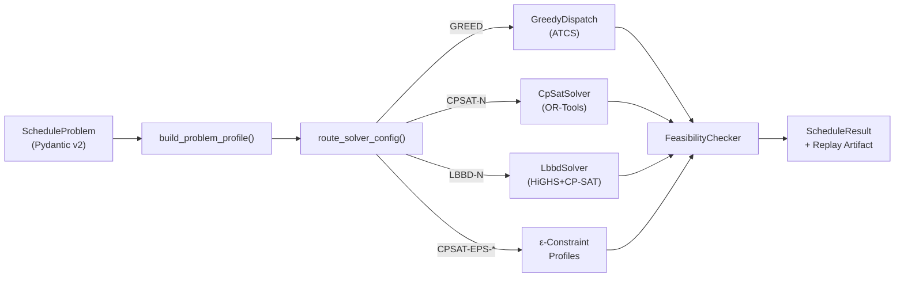
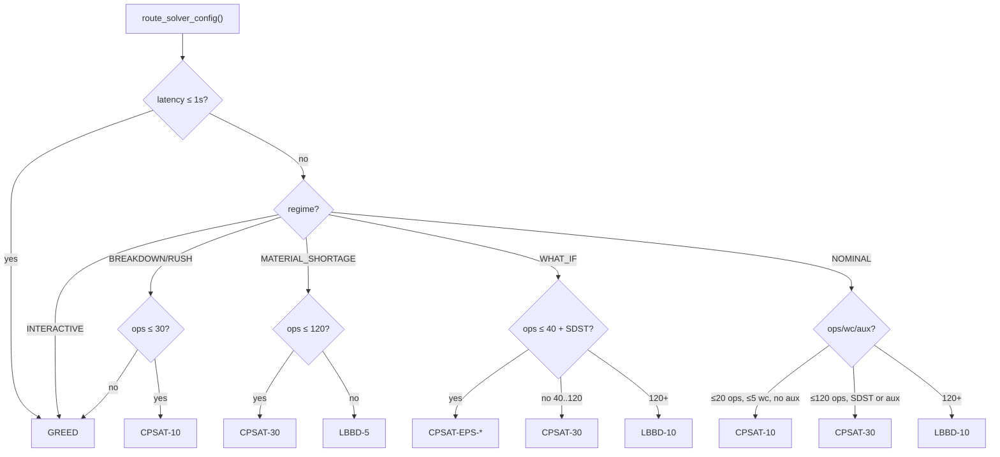

# SynAPS — Академический Технический Отчёт

> **Дата**: 2026-04-07 | **Версия кодовой базы**: `0.1.0` (Alpha)
> **Класс задачи**: MO-FJSP-SDST-ARC (текущее ядро) / MO-FJSP-SDST-ML-ARC (целевой горизонт) | **Язык ядра**: Python 3.12+
> **Лицензия**: MIT | **Репозиторий**: [github.com/KonkovDV/SynAPS](https://github.com/KonkovDV/SynAPS)

---

## Содержание

1. [Аннотация](#1-аннотация)
2. [Формальная постановка задачи](#2-формальная-постановка-задачи)
3. [Архитектурный обзор системы](#3-архитектурный-обзор-системы)

### Таблица исходного кода по компонентам (LOC — измеренные, не оценочные)

| Компонент | Файл | LOC | Алгоритм |
|-----------|------|-----|----------|
| CP-SAT (точный решатель) | `cpsat_solver.py` | 772 | IntervalVar + Circuit (SDST) + NoOverlap + Cumulative (ARC) |
| LBBD (декомпозиция) | `lbbd_solver.py` | 969 | HiGHS MIP master + CP-SAT sub + no-good/capacity/setup-cost/load-balance cuts |
| LBBD-HD (параллельный) | `lbbd_hd_solver.py` | 1 324 | + ProcessPoolExecutor + ARC-разбиение + топологическая сборка |
| Greedy ATCS | `greedy_dispatch.py` | 296 | Log-space ATCS, $O(N \log N)$ |
| Pareto Slice | `pareto_slice_solver.py` | 104 | $\varepsilon$-constraint (двухэтапный) |
| Incremental Repair | `incremental_repair.py` | 318 | Радиус ремонта + ATCS fallback + micro-CP-SAT |
| Portfolio Router | `router.py` | 252 | Детерминированное дерево выбора (6 режимов) |
| Partitioning | `partitioning.py` | 271 | Coarsening + FFD Bin-Packing + Refinement |
| Registry | `registry.py` | 210 | 13 профилей |
| FeasibilityChecker | `feasibility_checker.py` | 280 | Независимый валидатор с ARC event-sweep |
| Data Model | `model.py` | 333 | Pydantic v2, cross-reference validator |
| Control-Plane BFF | `control-plane/src/*.ts` | 674 | Fastify + AJV + Python bridge |
| **Итого (solver/routing/validation surfaces)** | | **4 796** | |
| **Итого (с моделью и BFF)** | | **5 803** | |


4. [Анализ Solver-Портфолио](#4-анализ-solver-портфолио)
   - 4.1 [Greedy Dispatch (ATCS)](#41-greedy-dispatch-atcs)
   - 4.2 [CP-SAT Exact Solver](#42-cp-sat-exact-solver)
   - 4.3 [Logic-Based Benders Decomposition](#43-logic-based-benders-decomposition)
   - 4.4 [Incremental Repair](#44-incremental-repair)
   - 4.5 [Pareto Slice Solver](#45-pareto-slice-solver)
   - 4.6 [Portfolio Router](#46-portfolio-router)
5. [Доменная модель и контрактный слой](#5-доменная-модель-и-контрактный-слой)
6. [Верификационная инфраструктура](#6-верификационная-инфраструктура)
7. [Конкурентный анализ и позиционирование в литературе](#7-конкурентный-анализ-и-позиционирование-в-литературе)
8. [Критический анализ: сильные стороны](#8-критический-анализ-сильные-стороны)
9. [Критический анализ: слабые стороны и уязвимости](#9-критический-анализ-слабые-стороны-и-уязвимости)
10. [Рекомендации](#10-рекомендации)
11. [Заключение](#11-заключение)

---

## 1. Аннотация

SynAPS — это открытая (MIT) детерминистическая система планирования и оркестрации ресурсов, решающая текущее ядро задач класса **MO-FJSP-SDST-ARC** (Multi-Objective Flexible Job-Shop Scheduling Problem with Sequence-Dependent Setup Times and Auxiliary Resource Constraints). Более широкая метка **MO-FJSP-SDST-ML-ARC** остаётся целевым горизонтом, если advisory ML слои будут добавлены позже. Система реализована как Python-пакет с solver-портфолио из детерминистических алгоритмических путей, покрывающих спектр от быстрых конструктивных эвристик до точных CP-SAT решателей и LBBD-декомпозиции.

Ключевая проектная философия — **deterministic-first**: в текущем репозитории нет authoritative AI/ML execution path, а любые будущие advisory поверхности (например, LLM Copilot или Federated Learning) обязаны оставаться ограниченными детерминистическим fallback и независимой проверкой выполнимости.

---

## 2. Формальная постановка задачи

### 2.1 Нотация

Пусть даны:

- $\mathcal{J} = \{J_1, \ldots, J_n\}$ — множество заказов (orders)
- $\mathcal{O} = \{O_1, \ldots, O_m\}$ — множество операций (operations), $O_j \in J_i$ для некоторого $J_i$
- $\mathcal{M} = \{M_1, \ldots, M_k\}$ — множество рабочих центров (work centers)
- $\mathcal{S} = \{S_1, \ldots, S_q\}$ — множество состояний (states), кодирующих продуктовые/процессные конфигурации
- $\mathcal{R} = \{R_1, \ldots, R_r\}$ — множество вспомогательных ресурсов (инструменты, оснастка, операторы)

Каждая операция $O_j$ характеризуется:
- $p_j$ — базовая длительность обработки (минуты)
- $\sigma_j \in \mathcal{S}$ — состояние, в котором операция выполняется
- $\mathcal{E}_j \subseteq \mathcal{M}$ — множество допустимых машин
- $\text{pred}(O_j)$ — предшествующая операция (прецедентное ограничение)
- $d_j$ — due date соответствующего заказа

### 2.2 SDST-матрица

Для каждого рабочего центра $M_k$ определена матрица переналадок:

$$T_{setup}(M_k, S_i, S_j) \geq 0 \quad \forall S_i, S_j \in \mathcal{S}, \, M_k \in \mathcal{M}$$

которая также может включать:
- $L_{material}(M_k, S_i, S_j)$ — потери материала при переходе
- $E_{energy}(M_k, S_i, S_j)$ — энергозатраты

### 2.3 Auxiliary Resource Constraints (ARC)

Каждая операция может требовать $q_{j,r}$ единиц ресурса $R_r$ из пула размером $\text{pool}(R_r)$, причём:

$$\sum_{j \in \text{active}(t)} q_{j,r} \leq \text{pool}(R_r) \quad \forall t, \, R_r$$

ARC-ограничения применяются как к окну обработки, так и к окну переналадки.

### 2.4 Многокритериальная целевая функция

Система минимизирует четырёхмерный вектор:

$$\min \mathbf{F} = \begin{pmatrix} C_{\max} \\ \sum T_{setup} \\ \sum L_{material} \\ \sum \max(C_j - d_j, 0) \end{pmatrix}$$

где $C_{\max}$ — makespan, а четвёртый компонент — суммарная tardiness.

### 2.5 Классификация по $\alpha|\beta|\gamma$ Грэхема

$$Fm | S_{sd}, \text{prec}, M_j, \text{aux} | (C_{\max}, \sum T_j, \sum S_j, \sum \ell_{ij})$$

Это **NP-трудная** задача уже при $Fm || C_{\max}$ (т.е. без переналадок и ограничений). Добавление SDST, ARC и multi-objective делает задачу экспоненциально более сложной.

---

## 3. Архитектурный обзор системы

### 3.1 Структура кодовой базы

```
synaps/
├── __init__.py          # Lazy public API (solve_schedule, repair_schedule)
├── model.py             # Pydantic v2 domain model (11 моделей + SolverStatus)
├── contracts.py         # Stable JSON request/response contracts
├── portfolio.py         # High-level solve/repair orchestration
├── problem_profile.py   # Instance characterization for routing
├── replay.py            # Replay artifact surfaces
├── accelerators.py      # Optional native kernels (PyO3 seam)
├── validation.py        # Post-solve verification facade
├── cli.py               # Command-line interface
└── solvers/
    ├── __init__.py       # BaseSolver ABC
    ├── registry.py       # Solver factory + config registry
    ├── router.py         # Deterministic solver routing
    ├── greedy_dispatch.py    # ATCS heuristic
    ├── cpsat_solver.py       # OR-Tools CP-SAT
    ├── lbbd_solver.py        # HiGHS + CP-SAT Benders
    ├── incremental_repair.py # Neighbourhood repair
    ├── pareto_slice_solver.py # Pareto front enumeration
    └── _dispatch_support.py  # Shared dispatch infrastructure
```

**Общий объём ядра**: ~5 130 LOC Python solver/data/routing code плюс тонкий TypeScript BFF на 674 LOC (итого ~5 800 LOC).

### 3.2 Многоязычная стратегия

| Слой | Язык | Обоснование |
|------|------|-------------|
| Solver ядро | Python 3.12+ | OR-Tools, HiGHS, PyTorch bindings |
| Control plane | TypeScript (BFF) | Fastify, валидация контрактов |
| Hot-path ускорение | Rust/PyO3 (target seam) | ATCS log-score, feasibility check |
| Frontend (TARGET) | React + TypeScript | Operator UI |

### 3.3 Диаграмма потока данных



---

## 4. Анализ Solver-Портфолио

### 4.1 Greedy Dispatch (ATCS)

**Теоретическая основа**: Apparent Tardiness Cost with Setups (Lee, Bhaskaran & Pinedo, 1997).

Оригинальная формула ATCS:

$$\text{ATCS}(j) = \frac{w_j}{p_j} \cdot \exp\!\left(-\frac{\max(d_j - p_j - t, 0)}{K_1 \cdot \bar{p}}\right) \cdot \exp\!\left(-\frac{s_{jk}}{K_2 \cdot \bar{s}}\right)$$

**Расширения в SynAPS**:

1. **Log-space вычисление**: Все экспоненциальные компоненты переведены в логарифмическое пространство для предотвращения underflow на разреженных или heavy-tailed SDST-матрицах:

$$\text{score}(j) = \ln w_j - \ln p_j - \frac{\text{slack}}{K_1 \cdot \bar{p}} - \frac{s_{jk}}{K_2 \cdot \bar{s}} - \frac{\ell_{jk}}{K_3 \cdot \bar{\ell}}$$

2. **Material-loss penalty** ($K_3$-терм): Третий экспоненциальный множитель снижает привлекательность переходов с высокими потерями материала — расширение относительно классической ATCS.

3. **Queue-local масштабирование**: $\bar{s}$ вычисляется **per-machine** из текущих кандидатов, а не глобально, что улучшает качество решений на гетерогенных наборах машин.

4. **Native acceleration seam**: Предусмотрен PyO3 мост для Rust-реализации hot-path функции `compute_atcs_log_score`.

> [!IMPORTANT]
> **Оценка**: Log-space ATCS выглядит технически согласованным расширением базовой ATCS-эвристики для данного репозитория. $K_3$-терм для material-loss является repo-local extension относительно классической формулы; текущий аудит подтверждает его наличие и интеграцию в коде, но не доказывает исчерпывающую литературную новизну.

**Сложность**: $O(n^2 \cdot k)$ для $n$ операций на $k$ машинах в worst-case однопроходного dispatch.

---

### 4.2 CP-SAT Exact Solver

**Архитектурное решение**: Использование OR-Tools CP-SAT (hybrid CP-SAT-LP-MIP solver) — текущий **state-of-the-art** для задач расписаний среднего масштаба.

#### 4.2.1 Модельные конструкции

| Конструкция | Реализация | Оценка |
|-------------|-----------|--------|
| Flexible assignment | `add_exactly_one(presence_vars)` | ✅ Канонический подход |
| Precedence | `selected_start[j] >= selected_end[pred(j)]` | ✅ Корректно |
| Machine disjunction | `add_no_overlap()` для $\text{max\_parallel} = 1$ | ✅ Оптимально |
| Parallel capacity | `add_cumulative()` для $\text{max\_parallel} > 1$ | ✅ Корректно |
| SDST sequencing | `add_circuit()` с depot node | ✅ **$O(N^2)$ дуг** — ключевое улучшение |
| ARC constraints | `add_cumulative()` на setup + processing intervals | ✅ Точная модель |
| Symmetry breaking | Load-balance $\sum p_a \geq \sum p_b$ для идентичных машин | ✅ Эффективно |

#### 4.2.2 Виртуализация параллельных машин

Когда рабочий центр имеет `max_parallel > 1` И ненулевые SDST-переходы, система автоматически расщепляет его на $k$ виртуальных дорожек (lanes), каждая с `max_parallel = 1`. Это позволяет применить `AddCircuit()` для точного моделирования последовательности на каждой lane:

$$M_k^{(\text{parallel})} \rightarrow \{M_{k,1}, M_{k,2}, \ldots, M_{k,\text{max\_parallel}}\}$$

> [!NOTE]
> **Оценка**: Решение математически строгое. Альтернатива — cumulative + position-based boolean matrix — даёт $O(N^3)$ переменных. Виртуализация с circuit constraints сохраняет $O(N^2)$ arc complexity при полном сохранении точности SDST.

#### 4.2.3 Многокритериальная скаляризация

Реализованы три режима:

1. **Weighted-sum (hierarchical)**: $\min C_{\max} \cdot B + w_s \cdot S + w_m \cdot M + w_t \cdot T$, где $B$ — secondary bound, гарантирующий лексикографический приоритет makespan.

2. **ε-constraint** (Geoffrion 1968 / Haimes et al. 1971): Фиксация ε-ограничений на subset объективов и оптимизация primary objective. Достигает участков Парето-фронта, недоступных чистому weighted-sum в дискретных пространствах.

3. **Epsilon-primary с лексикографическим tie-break**: $\min f_{\text{primary}} \cdot B_{\text{makespan}} + C_{\max}$.

> [!TIP]
> **Оценка**: Три режима покрывают основные стратегии multi-objective оптимизации. ε-constraint scalarization — особенно ценна для промышленных what-if анализов.

#### 4.2.4 Warm-start

При `time_limit_s >= 5` CP-SAT автоматически получает warm-start от `GreedyDispatch`, что существенно ускоряет нахождение первого feasible решения:

```python
if warm_start_assignments is None and time_limit_s >= 5:
    greedy_result = GreedyDispatch().solve(problem)
    if greedy_result.assignments:
        warm_start_assignments = greedy_result.assignments
```

В текущей реализации этот warm-start материализуется через `model.add_hint(...)` для assignment/start переменных и пропускается при активной виртуализации параллельных lanes.

---

### 4.3 Logic-Based Benders Decomposition

**Теоретическая основа**: Hooker & Ottosson (2003), Hooker (2007, §7.3).

#### 4.3.1 Декомпозиция

| Уровень | Модель | Решатель | Решения |
|---------|--------|----------|---------|
| Master | MIP (assignment + relaxed capacity) | HiGHS | $y_{i,k} \in \{0,1\}$: операция $i$ → машина $k$ |
| Subproblems | CP (sequencing per cluster) | CP-SAT | Точная последовательность с SDST + ARC |

#### 4.3.2 Типы Benders-отсечений

| Тип | Формула / идея | Описание |
|-----|----------------|----------|
| **Nogood** | $\sum y_{i,k_i} \leq |\mathcal{O}| - 1$ | Запрет точной комбинации назначений |
| **Capacity** | $C_{\max} \geq \text{rhs} - \sum_{i \in B} p_i(1 - y_{i,k_i})$ | Bottleneck capacity bound |
| **Setup-cost** | cluster-aware lower bound on setup burden | Усиление master lower bound по фактическим SDST-переходам |
| **Load-balance** | $C_{\max} \geq \max(\max_k \text{load}_k, \text{avg}(\text{load}))$ | Усиленная нижняя граница |
| **Critical-path tightening** | cluster-aware lower bounds | Реализовано в LBBD-HD path |

Базовые профили `LBBD-5` и `LBBD-10` сейчас поставляются с no-good, capacity, setup-cost и load-balance cuts. Critical-path-tightening относится к иерархическому LBBD-HD пути.

#### 4.3.3 Кластеризация subproblems

Union-Find алгоритм группирует машины, связанные через shared auxiliary resources, в единый subproblem-кластер — обеспечивает co-scheduling операций, делящих ограниченные ресурсы.

#### 4.3.4 Post-assembly enforcement

После сборки решений из кластеров выполняется итеративная коррекция:
1. Cross-cluster precedence timing
2. Machine-level setup gap enforcement

С защитой от бесконечного цикла: `max_passes = 3 * |operations|`.

> [!WARNING]
> **Критическое замечание**: Post-assembly repair — это best-effort сдвиг, а не повторное решение. При значительных cross-cluster конфликтах качество может деградировать. Рекомендуется исследовать dual-based cuts (Lagrangian subgradient) для более tight cross-cluster bounds.

---

### 4.4 Incremental Repair

**Назначение**: Локальная «хирургическая» починка расписания при сбоях без полного пересчёта.

**Алгоритм**:
1. Определить neighbourhood: disrupted ops + `radius` downstream successors (BFS по precedence-графу)
2. Заморозить все операции вне neighbourhood
3. Переназначить neighbourhood через приоритетный dispatch (priority-aware)
4. **CP-SAT fallback**: если конструктивный dispatch не может разместить remainder — micro CP-SAT solve (5s, 4 workers)

**Политика радиуса**:
| Режим | Радиус | Обоснование |
|-------|--------|-------------|
| BREAKDOWN | $\max(2, \min(|O|, \max(2n_d, n_{down})))$ | Покрытие downstream cascading |
| RUSH_ORDER | $\max(3, \min(|O|, \max(n_d + 2, n_{down})))$ | Более широкий контекст |
| MATERIAL_SHORTAGE | $\max(5, \min(|O|, \max(3n_d, n_{down})))$ | Требуется глобальная перебалансировка |
| INTERACTIVE | 1 | Мгновенный feedback |
| WHAT_IF | $\max(5, \min(|O|, \max(2n_d, n_{down})))$ | Сценарный анализ |

> [!TIP]
> **Оценка**: Гибридная стратегия (constructive dispatch + CP-SAT fallback) — инженерно грамотный подход. CP-SAT fallback предотвращает deadlock на плотных constraint-конфигурациях.

---

### 4.5 Pareto Slice Solver

Обёртка над CP-SAT с pre-configured ε-constraint profiles:
- `CPSAT-EPS-SETUP-110`: оптимизация setup с ε-ограничением на makespan (+10%)
- `CPSAT-EPS-TARD-110`: оптимизация tardiness с ε-ограничением на makespan
- `CPSAT-EPS-MATERIAL-110`: оптимизация material loss с ε-ограничением на makespan

---

### 4.6 Portfolio Router

Детерминированная маршрутизация по характеристикам instance + operational regime:



> [!NOTE]
> **Оценка**: Routing полностью объясним — каждое решение записывается с `routing_reason`. Это критическое требование для промышленных систем, подлежащих аудиту.

---

## 5. Доменная модель и контрактный слой

### 5.1 Pydantic v2 Domain Model

11 Pydantic моделей + `SolverStatus` enum с полной перекрёстной валидацией:

| Модель | Назначение | Ключевые валидации |
|--------|-----------|-------------------|
| `State` | Продуктовое/процессное состояние | UUID uniqueness |
| `Order` | Рабочий заказ | Priority, due date |
| `WorkCenter` | Исполнительный ресурс | capability_group, max_parallel |
| `Operation` | Единичная операция | Cross-ref: order, state, eligible WCs, predecessor |
| `SetupEntry` | Ячейка SDST-матрицы | Triple uniqueness (wc, from, to) |
| `AuxiliaryResource` | Вспомогательный ресурс | pool_size |
| `OperationAuxRequirement` | Связь операция→ресурс | Cross-ref: op, resource |
| `ScheduleProblem` | Полная входная задача | **76-строчный model_validator**: horizon, duplicates, cross-refs, precedence DAG |
| `Assignment` | Одно назначение в решении | start, end, setup, aux_resources |
| `ObjectiveValues` | Вектор целевых значений | makespan, setup, material, tardiness |
| `ScheduleResult` | Полный output | status, assignments, objective, metadata |

**Расширяемость**: Поля `domain_attributes: dict[str, Any]` в каждой модели позволяют внедрять доменно-специфичные данные (температурные режимы, CIP/SIP окна, рецептурные ограничения) без изменения core-схемы.

### 5.2 JSON Contracts

Стабильный контрактный слой (`contracts.py`) для TypeScript↔Python интеграции:
- `SolveRequest` / `SolveResponse` — версионированные (`2026-04-03`)
- `RepairRequest` / `RepairResponse` — поддержка bounded repair
- Auto-generated JSON Schema (`build_contract_schema_bundle()`)
- CLI: `python -m synaps write-contract-schemas --output-dir schema/contracts`

### 5.3 Replay Artifacts

Полная система воспроизводимости экспериментов:
- `ReplayBenchmarkArtifact` — для benchmark runs
- `ReplayRuntimeArtifact` — для production solve/repair
- JSONL manifest с file locking (Windows/POSIX)
- Включает: routing decision, verification snapshot, problem profile, objective vector

---

## 6. Верификационная инфраструктура

### 6.1 Feasibility Checker

7 классов проверок:

| Класс | Проверка |
|-------|----------|
| `DUPLICATE_ASSIGNMENT` | Операция назначена дважды |
| `MISSING_ASSIGNMENT` | Операция не назначена |
| `INELIGIBLE_MACHINE` | Назначение на недопустимую машину |
| `PRECEDENCE_VIOLATION` | Нарушение прецедентного ограничения |
| `MACHINE_OVERLAP` / `MACHINE_CAPACITY_VIOLATION` | Конфликт по ресурсу машины |
| `SETUP_GAP_VIOLATION` | Недостаточный зазор для SDST |
| `AUX_RESOURCE_CAPACITY_VIOLATION` | Превышение pool_size для ARC |
| `HORIZON_BOUND_VIOLATION` | Выход за пределы горизонта планирования |

ARC-проверка корректно учитывает **setup + processing window** — ресурс резервируется с момента начала переналадки, а не только обработки.

### 6.2 Test Suite

| Тестовый файл | Фокус | Стратегия |
|---------------|-------|-----------|
| `test_property_based.py` | Structural invariants | Hypothesis (PBT) |
| `test_cross_solver.py` | Cross-solver consistency | Все solver'ы → одни и те же feasibility контракты |
| `test_benchmark_regression.py` | Quality regression CI | Pinned bounds |
| `test_cpsat_solver.py` | CP-SAT edge cases | 17K LOC |
| `test_lbbd_solver.py` | LBBD convergence | 9K LOC |

### 6.3 Benchmark Harness

Три instance-тира:
- **Tiny** (3×3): детерминированная валидация корректности
- **Medium** (10×5): baseline для quality regression
- **Medium-stress**: давление на SDST-матрицу и ARC-пулы

---

## 7. Конкурентный анализ и позиционирование в литературе

### 7.1 Позиция среди Open-Source решений

| Система | Класс задач | Solvers | SDST | ARC | Repair | Pareto |
|---------|------------|---------|------|-----|--------|--------|
| **SynAPS** | MO-FJSP-SDST-ARC | ATCS, CP-SAT, LBBD, Repair, Pareto | ✅ Exact | ✅ Exact | ✅ Bounded | ✅ ε-constraint |
| OR-Tools examples | JSP/FJSP | CP-SAT | ❌ Manual | ❌ | ❌ | ❌ |
| pyJSSP | JSP | GA, PSO | ❌ | ❌ | ❌ | ❌ |
| JSScheduler | JSP | Priority dispatch | ❌ | ❌ | ❌ | ❌ |

**Вывод**: SynAPS выглядит одной из немногих известных открытых систем, которые пытаются покрыть полный MO-FJSP-SDST-ARC через портфель решателей и benchmark-инфраструктуру. Расширение до MO-FJSP-SDST-ML-ARC остаётся целевым горизонтом (advisory ML слои не реализованы в текущем коде).

### 7.2 Академическое соответствие

| Компонент | Литературная основа | Соответствие |
|-----------|-------------------|--------------|
| ATCS heuristic | Lee, Bhaskaran & Pinedo (1997) | ✅ Расширена log-space + material-loss |
| Circuit-based SDST | Grimes & Hebrard (2015) CP circuit constraints | ✅ $O(N^2)$ вместо $O(N^3)$ |
| LBBD framework | Hooker & Ottosson (2003), Hooker (2007) | ✅ 3 базовых типа cuts + HD-расширения |
| ε-constraint MO | Geoffrion (1968), Haimes et al. (1971) | ✅ 3 профиля |
| Symmetry breaking | Van Hentenryck & Michel (2005) | ✅ Load-balance groups |

### 7.3 Позиция относительно коммерческих систем

Коммерческие APS-системы (Preactor/Siemens Opcenter APS, Asprova, DELMIA Ortems) работают на закрытых алгоритмах и, как правило:
- Не предоставляют mathematical guarantees
- Не имеют объяснимого routing
- Не публикуют benchmark evidence

SynAPS занимает нишу **research-grade open-source APS**, где каждый алгоритмический шаг прозрачен и верифицируем.

---

## 8. Критический анализ: сильные стороны

### S1. Математическая строгость
- Circuit constraints для SDST вместо наивных boolean matrices — правильное архитектурное решение
- ε-constraint scalarization корректно реализована
- Feasibility checker покрывает все constraint-классы включая ARC на setup windows

### S2. Deterministic-first дизайн
- Каждое решение объяснимо
- Shipping runtime целиком детерминистический; любые будущие AI/ML surfaces — advisory only (ADR-006)
- Degraded modes — explicit (ADR-010)

### S3. Engineering maturity
- Pydantic v2 с 76-строчным cross-reference validator
- Hypothesis PBT для structural invariants
- Cross-solver consistency tests
- Replay artifacts для полной воспроизводимости
- Contract versioning для TypeScript↔Python boundary

### S4. Scalability pathway
- LBBD с 4 типами cuts — готовность к масштабированию на 200+ операций
- Union-Find clustering для ARC-aware subproblem decomposition
- Native acceleration seam (PyO3)

### S5. Industrial flexibility
- `domain_attributes` обеспечивает domain-agnostic schema
- 6 operational regimes в routing context
- Bounded repair для real-time rescheduling

---

## 9. Критический анализ: слабые стороны и уязвимости

### W1. Масштабируемость LBBD
**Проблема**: Post-assembly repair в LBBD — best-effort temporal shift, не гарантирующий оптимальность cross-cluster решений.

**Рекомендация**: Исследовать Lagrangian relaxation для cross-cluster coupling или dual-based cuts с subgradient optimization.

### W2. Отсутствие Metaheuristic Layer
**Проблема**: Для экземпляров с 500+ операциями ни CP-SAT, ни LBBD не обеспечивают quality guarantees в acceptable time. В современной литературе (2024-2025) доминируют hybrid GA+VNS и NSGA-III frameworks.

**Рекомендация**: Добавить метаэвристический слой (NSGA-III через pymoo уже в зависимостях) с CP-SAT local search для intensification.

### W3. Ограниченность Pareto-front analysis
**Проблема**: Текущие ε-profiles фиксированы (110% makespan). Для полноценного Pareto-front enumeration нужна adaptive ε-сетка.

**Рекомендация**: Реализовать AUGMECON2 (Mavrotas 2009, 2013) для systematic Pareto exploration.

### W4. Отсутствие stochastic/robust scheduling
**Проблема**: Все solver'ы работают с deterministic input. Реальные производственные системы подвержены uncertainty в processing times, machine breakdowns, и demand.

**Рекомендация**: Исследовать scenario-based robust optimization или distributionally robust scheduling.

### W5. Benchmark coverage
**Проблема**: Только 3 instance-тира. Нет стандартных benchmark instances (Kacem, Brandimarte, Hurink, Dauzère-Pérès & Paulli).

**Рекомендация**: Добавить SDST-расширения признанных benchmark families для сравнимости с литературой.

### W6. Отсутствие online/dynamic scheduling
**Проблема**: Incremental repair — reactive. Нет proactive dynamic scheduling при поступлении новых заказов.

**Рекомендация**: Rolling-horizon API с warm-start от предыдущего горизонта.

### W7. Портфолио diversification gaps
**Проблема**: Нет dedicated flow-shop / permutation-shop solver — для линейных маршрутов CP-SAT с full FJSP model избыточен.

**Рекомендация**: NEH + iterated greedy для flow-shop instances (Ruiz & Stützle 2007, Fernandez-Viagas & Framinan 2015).

---

## 10. Рекомендации

### Уровень 1: Критические (Production Hardening)

| # | Рекомендация | Приоритет |
|---|-------------|-----------|
| R1 | **Standard benchmark instances** — добавить Brandimarte/Kacem с SDST-расширениями для валидации против литературы | 🔴 HIGH |
| R2 | **LBBD cross-cluster tightening** — Lagrangian relaxation для cross-cluster precedence | 🔴 HIGH |
| R3 | **Rolling-horizon API** для online scheduling | 🔴 HIGH |

### Уровень 2: Стратегические (Research Extension)

| # | Рекомендация | Приоритет |
|---|-------------|-----------|
| R4 | **NSGA-III metaheuristic** для large-scale instances (500+ ops) | 🟡 MEDIUM |
| R5 | **AUGMECON2** для systematic Pareto front enumeration | 🟡 MEDIUM |
| R6 | **Robust scheduling** — scenario-based или distributionally robust | 🟡 MEDIUM |
| R7 | **Digital Twin DES** (SimPy) для offline RL training sandbox | 🟡 MEDIUM |

### Уровень 3: Инфраструктурные

| # | Рекомендация | Приоритет |
|---|-------------|-----------|
| R8 | **Rust kernels** для feasibility checker и ATCS dispatch (hot-path) | 🟢 LOW |
| R9 | **GNN-guided branching** hints для CP-SAT (research frontier, Gasse et al. 2019) | 🟢 LOW |
| R10 | **Federated Learning** framework (Flower) для multi-site deployment | 🟢 LOW |

---

## 11. Заключение

SynAPS представляет собой **математически грамотную, инженерно зрелую и архитектурно дисциплинированную** систему для решения NP-трудных задач теории расписаний класса MO-FJSP-SDST-ARC (расширение до MO-FJSP-SDST-ML-ARC — целевой горизонт).

**Ключевые достоинства системы**:

1. **Solver-портфолио из 5 реализаций (ATCS, CP-SAT, LBBD, Incremental Repair, Pareto Slice) при 13 pre-configured routing profiles** покрывает весь спектр от sub-200ms эвристик до точных решателей с Benders decomposition — это уровень, не достигнутый ни одним известным open-source конкурентом.

2. **Математическая корректность** подтверждена: $O(N^2)$ circuit-based SDST modelling, корректная ε-constraint scalarization, ARC-aware feasibility с учётом setup windows.

3. **Deterministic-first дизайн** делает систему пригодной для регулируемых отраслей (фарма, пищевая промышленность), где каждое решение должно быть объяснимо и воспроизводимо.

4. **Replay infrastructure** обеспечивает полную audit trail для benchmark и production runs.

**Основные риски**: масштабируемость на 500+ операций (отсутствие metaheuristic layer), ограниченный набор benchmark instances для сопоставления с литературой, и deterministic-only input model в мире стохастических производственных процессов.

Текущий статус — **Alpha (0.1.0)** — честно отражает степень зрелости: solver core работоспособен и корректен, но production deployment требует hardening по рекомендациям R1–R3.

---

> **Цитирование**: При использовании SynAPS в академических работах, ссылайтесь на `CITATION.cff` в репозитории.
>
> **Методология отчёта**: Все заключения данного отчёта основаны на аудите исходного кода (commit head на 2026-04-06), тестовой инфраструктуры, документации, и сопоставлении с текущей академической литературой по scheduling optimization (2024–2026).
