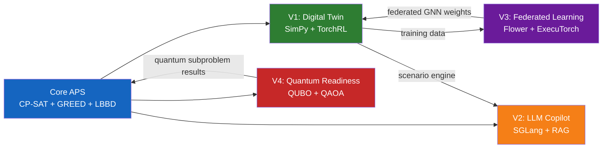
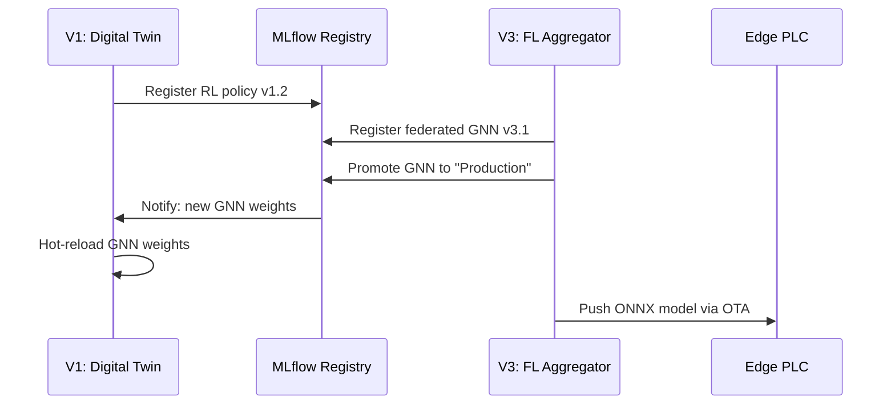
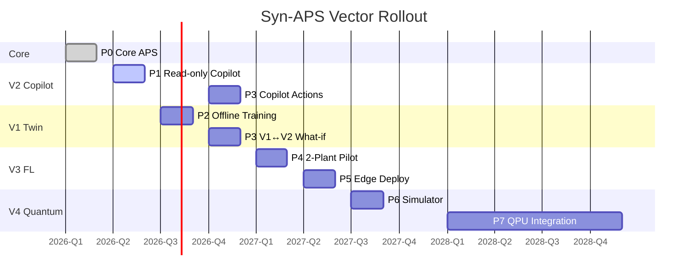

# Cross-Vector Integration Map

> **Purpose**: Dependency graph, interaction matrix, shared infrastructure, and risk analysis across the four evolution vectors (V1–V4).

<details><summary>🇷🇺 Краткое описание</summary>

Карта интеграции четырёх эволюционных векторов Syn-APS: Цифровой двойник (V1), LLM-копилот (V2), Федеративное обучение (V3), Квантовая готовность (V4). Граф зависимостей, матрица взаимодействия, разделяемая инфраструктура (NATS, Temporal, MLflow, PG+pgvector, ClickHouse, MinIO, ONNX Runtime), матрица рисков R1–R10, стратегия поэтапного развёртывания.
</details>

---

## 1. Evolution Vector Summary

| Vector | Title | Core Technology | Primary Deliverable |
|--------|-------|----------------|---------------------|
| **V1** | [Digital Twin & DES](V1_DIGITAL_TWIN_DES.md) | SimPy + TorchRL | Offline RL dispatch policies trained on digital twin |
| **V2** | [LLM Copilot](V2_LLM_COPILOT.md) | SGLang + GLM-5.1 + RAG | Natural-language scheduling assistant |
| **V3** | [Federated Learning](V3_FEDERATED_LEARNING.md) | Flower FL + ExecuTorch | Cross-plant GNN training without data sharing |
| **V4** | [Quantum Readiness](V4_QUANTUM_READINESS.md) | D-Wave + PennyLane | QUBO/QAOA hybrid for combinatorial subproblems |

---

## 2. Dependency Graph



### Dependency Semantics

| From → To | Dependency Type | Data Flow | Coupling |
|-----------|----------------|-----------|----------|
| Core → V1 | Hard | Schedule + plant model → SimPy environment | Async (NATS events) |
| Core → V2 | Hard | Schema + solver output → RAG corpus | Async (PG + NATS) |
| Core → V4 | Soft | Assignment subproblem → QUBO encoding | Sync (API call) |
| V1 → V2 | Soft | DES scenarios → copilot what-if engine | Async (NATS request-reply) |
| V1 → V3 | Hard | Local trajectories → FL aggregation | Async (Flower gRPC) |
| V3 → V1 | Soft | Federated GNN weights → local twin | Async (model registry) |
| V4 → Core | Soft | Quantum solution → classical refinement | Sync (merge step) |

**Coupling legend**: *Hard* = feature is blocked without dependency. *Soft* = feature degrades gracefully without dependency.

---

## 3. Interaction Matrix

Shows how vectors **produce** (→) and **consume** (←) shared artifacts.

| Artifact | V1 Produces | V1 Consumes | V2 Produces | V2 Consumes | V3 Produces | V3 Consumes | V4 Produces | V4 Consumes |
|----------|:-----------:|:-----------:|:-----------:|:-----------:|:-----------:|:-----------:|:-----------:|:-----------:|
| **Schedule events** | | ← | | ← | | | | |
| **DES trajectories** | → | | | ← | | ← | | |
| **GNN model weights** | | ← | | | → | | | |
| **RL policy checkpoints** | → | | | | | ← | | |
| **RAG documents** | | | → | | | | | |
| **NL query results** | | | → | | | | | |
| **QUBO subproblem** | | | | | | | | ← |
| **Quantum solution** | | | | | | | → | |
| **Edge model (ONNX)** | | | | | → | | | |
| **Experiment metadata** | → | | → | | → | | → | |

---

## 4. Shared Infrastructure

All four vectors share a common platform layer to minimize operational complexity.

| Component | Role | Used By | Config Surface |
|-----------|------|---------|---------------|
| **NATS JetStream 2.11** | Event backbone, request-reply | V1 (events), V2 (queries), V3 (FL coordination) | `streams.yaml` |
| **PostgreSQL 18** | Relational store + pgvector | V2 (RAG embeddings), Core (schedule data) | `schema/ddl/` |
| **ClickHouse** | Analytics projection | V1 (trajectory stats), V2 (query analytics) | `clickhouse/` |
| **MLflow 2.x** | Experiment tracking, model registry | V1 (RL experiments), V3 (FL rounds), V4 (QAOA circuits) | `mlflow.yaml` |
| **MinIO** (S3-compatible) | Artifact store | V1 (checkpoints), V3 (model files), V4 (QUBO matrices) | `minio.yaml` |
| **Temporal** | Workflow orchestration | V1 (training pipelines), V3 (FL cycles), V4 (hybrid loop) | `temporal/` |
| **ONNX Runtime** | Inference normalization | V1 (RL → ONNX), V3 (GNN → ONNX → ExecuTorch) | embedded |
| **Prometheus + Grafana** | Observability | All vectors | `monitoring/` |

### Infrastructure Dependency Matrix

```
           NATS  PG18  CH   MLflow  MinIO  Temporal  ONNX  Prom
Core APS    ✓     ✓    ·     ·       ·       ·       ·     ✓
V1 Twin     ✓     ·    ✓     ✓       ✓       ✓       ✓     ✓
V2 Copilot  ✓     ✓    ✓     ·       ·       ·       ·     ✓
V3 FL       ✓     ·    ·     ✓       ✓       ✓       ✓     ✓
V4 Quantum  ·     ·    ·     ✓       ✓       ✓       ·     ✓
```

---

## 5. Integration Patterns

### 5.1 Event-Driven Integration (Primary)

Vectors communicate via NATS JetStream subjects, preserving loose coupling.

```
syn-aps.schedule.published     → V1 (twin update), V2 (RAG index)
syn-aps.twin.trajectory.done   → V3 (FL aggregation trigger)
syn-aps.fl.model.updated       → V1 (weight refresh)
syn-aps.quantum.result         → Core (solution merge)
syn-aps.copilot.query          → V2 (RAG pipeline)
syn-aps.copilot.whatif         → V1 (scenario fork)
```

### 5.2 Synchronous Integration (Secondary)

Used only when latency requirements demand it:
- **V4 → Core**: QUBO solution returned within solver timeout
- **V2 → Core**: NL→APS-SQL translation with immediate response

### 5.3 Model Registry Pattern



---

## 6. Risk Matrix

| ID | Risk | Vectors Affected | Likelihood | Impact | Mitigation |
|----|------|-----------------|------------|--------|------------|
| **R1** | NATS cluster failure | V1, V2, V3 | Low | Critical | Multi-node cluster, automatic failover, event replay from WAL |
| **R2** | GNN model divergence in FL | V3 → V1 | Medium | High | FedProx regularization, model validation gate, rollback to last stable |
| **R3** | LLM hallucination in copilot | V2 | Medium | Medium | RAG grounding, confidence thresholds, human-in-the-loop for actions |
| **R4** | Quantum hardware unavailability | V4 | High (2025) | Low | Graceful fallback to `neal` simulated annealing → CP-SAT |
| **R5** | Sim-to-real gap in digital twin | V1 | Medium | High | Auto-calibration from IoT telemetry, gap monitoring metric |
| **R6** | Edge model staleness | V3 | Medium | Medium | OTA update pipeline with version tracking, max-age policy |
| **R7** | Data privacy violation in FL | V3 | Low | Critical | Differential privacy (ε-budget), secure aggregation, audit logging |
| **R8** | MLflow registry corruption | V1, V3, V4 | Low | High | MinIO-backed artifact store with snapshots, model checksums |
| **R9** | Temporal workflow timeout | V1, V3, V4 | Medium | Medium | Retry policies, dead-letter queue, alerting |
| **R10** | Cross-vector version skew | All | Medium | High | Semantic versioning on all inter-vector contracts, compatibility matrix in CI |

### Risk Heat Map

```
Impact ↑
  Critical │ R7 ·  ·  R1
    High   │ R8 R5 R2 R10
  Medium   │ R6 R3 R9 ·
    Low    │ ·  R4 ·  ·
           └──────────────→ Likelihood
             Low  Med  High
```

---

## 7. Phased Rollout Strategy

Vectors are deployed in dependency order to minimize integration risk.

| Phase | Quarter | Deliverable | Prerequisites |
|-------|---------|------------|---------------|
| **P0** | Q1 2026 | Core APS (CP-SAT + GREED + LBBD) | Schema, event backbone |
| **P1** | Q2 2026 | V2: LLM Copilot (read-only) | Core APS, PG18 + pgvector |
| **P2** | Q3 2026 | V1: Digital Twin (offline training) | Core APS, NATS, MLflow |
| **P3** | Q4 2026 | V2: Copilot actions + V1↔V2 what-if | V1 + V2 integration |
| **P4** | Q1 2027 | V3: Federated Learning (2-plant pilot) | V1 (training data source) |
| **P5** | Q2 2027 | V3: Edge deployment (ExecuTorch) | V3 FL + ONNX export |
| **P6** | Q3 2027 | V4: Quantum hybrid (simulator) | Core APS, neal |
| **P7** | 2028+ | V4: Quantum hardware integration | QPU access, error correction |



---

## 8. Testing Cross-Vector Interactions

| Test Type | Scope | Frequency | Tooling |
|-----------|-------|-----------|---------|
| **Contract tests** | NATS message schemas between vectors | Every PR | JSON Schema + pytest |
| **Integration tests** | V1↔V2 what-if roundtrip | Weekly | Docker Compose, testcontainers |
| **Chaos tests** | NATS partition, MLflow unavailability | Monthly | Litmus, custom fault injector |
| **End-to-end** | Full pipeline: schedule → twin → FL → copilot | Release gate | Kubernetes staging environment |

---

*Cross-vector integration map version 1.0 — 2026-04.*
