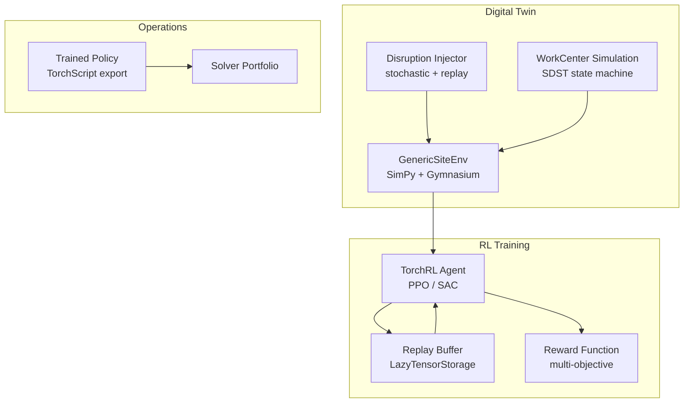

# V1 — Digital Twin & Discrete-Event Simulation

> **Vector scope**: Embed a SimPy-based discrete-event simulation (DES) inside the scheduling loop for what-if analysis, reinforcement learning (RL) training, and disruption scenario planning.
>
> **Current status**: target architecture only. The standalone SynAPS repository does not currently ship a DES runtime, RL policy training loop, or production digital-twin integration. This document describes the intended next vector above the current deterministic kernel.

<details><summary>🇷🇺 Краткое описание</summary>

Цифровой двойник операций на основе SimPy. Позволяет запускать what-if сценарии, тренировать RL-агентов (TorchRL) для динамического перепланирования и моделировать каскадные сбои до их наступления. Среда `GenericSiteEnv` параметризуется через `domain_attributes` — одна кодовая база для любой отрасли.
</details>

---

## 1. Architecture



---

## 2. GenericSiteEnv

```python
"""Gymnasium-compatible environment wrapping SimPy DES."""

import simpy
import gymnasium as gym
import numpy as np
from gymnasium import spaces


class GenericSiteEnv(gym.Env):
    """
    Universal site simulation parametrized by domain_attributes.

    Observation space:
        - Work center utilization (float per WC)
        - Queue lengths (int per WC)
        - Time to next due date (float per order)
        - Current disruption flags (bool per WC)

    Action space:
        Discrete: dispatch next operation to one of N eligible machines,
        or trigger re-plan.
    """

    metadata = {"render_modes": ["human", "ansi"]}

    def __init__(self, config: dict) -> None:
        super().__init__()
        self.n_work_centers = config.get("n_work_centers", 10)
        self.n_orders = config.get("n_orders", 50)

        obs_dim = self.n_work_centers * 3 + self.n_orders
        self.observation_space = spaces.Box(
            low=0.0, high=1.0, shape=(obs_dim,), dtype=np.float32
        )
        self.action_space = spaces.Discrete(self.n_work_centers + 1)  # +1 for re-plan

        self.env: simpy.Environment | None = None

    def reset(self, *, seed=None, options=None):
        super().reset(seed=seed)
        self.env = simpy.Environment()
        obs = np.zeros(self.observation_space.shape, dtype=np.float32)
        return obs, {}

    def step(self, action: int):
        # Advance SimPy by one dispatch decision
        reward = 0.0
        terminated = False
        truncated = False
        obs = np.zeros(self.observation_space.shape, dtype=np.float32)
        info: dict = {}
        return obs, reward, terminated, truncated, info
```

---

## 3. Disruption Model

| Disruption Type | Distribution | Parameters | Effect |
|----------------|-------------|-----------|--------|
| Machine breakdown | Weibull | shape=1.5, scale varies by WC age | WC offline for repair duration |
| Rush order injection | Poisson | λ = 0.3 orders/hour | New high-priority order |
| Material shortage | Bernoulli | p = 0.05 per operation start | Operation blocked until resupply |
| Quality rejection | Bernoulli | p = 0.02 per operation end | Re-work or scrap, ripple effect |
| Operator absence | Exponential | μ = 8 hours | Auxiliary resource pool reduced |

---

## 4. RL Stack (SOTA 2026)

| Component | Library | Version | Role |
|-----------|---------|---------|------|
| Environment | SimPy + Gymnasium | 4.x + 1.0 | DES engine + RL interface |
| Agent | TorchRL | 0.6+ | PPO, SAC, multi-objective reward |
| Replay buffer | TorchRL LazyTensorStorage | 0.6+ | Efficient GPU-backed buffer |
| Export | TorchScript | PyTorch 2.6 | Inference in operations (no Python dep) |
| Logging | TensorBoard / W&B | latest | Training metrics |

### 4.1 Reward Function

$$
R_t = -\alpha \cdot \Delta T_{makespan} - \beta \cdot \Delta T_{tardiness} - \gamma \cdot \Delta S_{setup} + \delta \cdot \mathbb{1}_{feasible}
$$

where $\Delta T$ denotes change from previous step, $\alpha, \beta, \gamma, \delta$ are tunable domain weights.

---

## 5. What-If Scenario API

```python
async def run_what_if(
    problem: ScheduleProblem,
    disruptions: list[DisruptionEvent],
    n_replications: int = 100,
    random_seed: int = 42,
) -> WhatIfReport:
    """Monte Carlo what-if analysis.

    Returns distribution of makespan, tardiness, and utilization
    across N stochastic replications.
    """
```

---

## 6. Integration with Solver Portfolio

| Mode | Trigger | Flow |
|------|---------|------|
| **Offline training** | Cron / manual | GenericSiteEnv → TorchRL → checkpoint → model registry |
| **Online inference** | Disruption detected | RL policy suggests repair action → Repair Engine validates → apply |
| **What-if** | Planner request | SimPy scenario → statistics → Gantt comparison |

---

## References

- Mnih, V. et al. (2015). Human-level control through deep reinforcement learning. *Nature*.
- Team SimPy (2024). SimPy Documentation.
- Bettini, M. et al. (2024). TorchRL: A data-driven decision-making library for PyTorch.
- ADR-014: Digital Twin DES integration.
