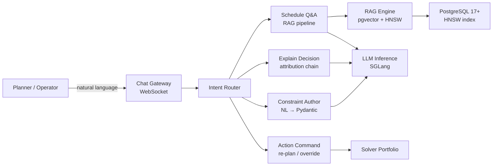

# V2 — LLM Copilot & Natural-Language Scheduling

> **Vector scope**: Augment the scheduler with an LLM-powered copilot for natural-language queries, schedule explanation (XAI), constraint authoring, and RAG-based documentation retrieval.

<details><summary>🇷🇺 Краткое описание</summary>

LLM-копилот для планировщика: естественно-языковые запросы к расписанию, генерация объяснений (XAI), авторинг ограничений через чат, RAG по документации и доменным данным. Стек: SGLang (инференс), GLM-5 (API) / GLM-4-32B (on-prem) / Qwen 2.5 (модели), PostgreSQL 17+ HNSW (векторный поиск), pgvector.
</details>

---

## 1. Architecture



---

## 2. LLM Model Selection (SOTA 2026)

| Model | Parameters | Use Case | Licence | Notes |
|-------|-----------|----------|---------|-------|
| GLM-5 (Z.ai API / self-hosted weights) | 744B (40B active, MoE) | Cloud copilot, complex reasoning | Apache-2.0 | Large open-weight option; hosted API is practical, local serving is hardware-heavy |
| GLM-4-32B-0414 | 32B | On-prem copilot, multi-turn, tool use | MIT | Best bilingual local-deployment option in the GLM family |
| Qwen 2.5 / Qwen3 | 7B / 32B | Fallback / multi-language | Apache-2.0 | Strong multilingual (EN/RU/ZH) |
| Phi-4-mini | 3.8B | Edge / air-gapped deployment | MIT | Runs on CPU / ExecuTorch |
| Domain fine-tune | LoRA on base | Scheduling-specific terminology | — | Fine-tune on schedule logs + docs |

---

## 3. RAG Pipeline

### 3.1 Document Sources

| Source | Chunking | Embedding | Index |
|--------|----------|-----------|-------|
| Architecture docs | Markdown heading boundaries | intfloat/multilingual-e5-large | pgvector HNSW |
| Schedule run logs | JSON event-level | same | pgvector HNSW |
| Setup matrix | Row-per-chunk | same | pgvector HNSW |
| Domain examples | JSON per-example | same | pgvector HNSW |

### 3.2 Retrieval Strategy

1. **Query embedding** → top-K cosine similarity from pgvector HNSW.
2. **Re-ranking** — cross-encoder (ms-marco-MiniLM-L-6-v2) on top-K.
3. **Context window** — assemble retrieved chunks + system prompt + conversation history.
4. **Generation** — SGLang constrained decoding with Pydantic schema (for structured outputs).

```sql
-- PostgreSQL 17+ + pgvector HNSW index
CREATE INDEX idx_doc_embeddings_hnsw
ON doc_chunks USING hnsw (embedding vector_cosine_ops)
WITH (m = 16, ef_construction = 200);
```

---

## 4. Intent Router

| Intent | Example | Action |
|--------|---------|--------|
| `schedule_query` | "What's the makespan for today's run?" | RAG → answer |
| `explain_decision` | "Why was OP-42 assigned to WC-3?" | XAI attribution chain |
| `author_constraint` | "Add a rule: WC-1 unavailable 14:00-16:00" | NL → Pydantic constraint → validate → apply |
| `action_command` | "Re-plan orders due tomorrow with rush priority" | Parse → solver dispatch → confirm |
| `general_chat` | "How does SDST work?" | RAG over docs → answer |

---

## 5. Constraint Authoring via NL

```
User: "Machine WC-1 cannot run jobs after 18:00 on Fridays"

LLM parses → AvailabilityConstraint(
    work_center_id="WC-1",
    unavailable_windows=[
        TimeWindow(day_of_week=4, start="18:00", end="23:59")
    ]
)

System: "I've added an availability constraint for WC-1:
         unavailable Fridays 18:00–23:59.
         Should I re-plan the current schedule? [Yes / No]"
```

---

## 6. XAI Attribution

For every assignment, the copilot can produce:

| Component | Method | Output |
|-----------|--------|--------|
| ATCS score breakdown | Formula decomposition | "Priority=600 → w_j=1.2; tardiness factor=0.85; setup factor=0.92 → ATCS=1.12" |
| CP-SAT dual values | Constraint relaxation | "Relaxing WC-3 capacity by 1 slot reduces makespan by 12 min" |
| GNN weight explanation | SHAP / attention weights | "Top 3 features: order priority (0.35), setup time (0.28), queue length (0.22)" |
| Repair decision | Neighbourhood log | "Repair radius=5 ops; 3 frozen, 2 re-dispatched; Nervousness=0.04" |

---

## 7. Inference Stack

| Component | Technology | Reason |
|-----------|-----------|--------|
| LLM serving | SGLang 0.4+ | RadixAttention, structured output, high throughput |
| Embedding | sentence-transformers | Lightweight, CPU-friendly |
| Vector DB | PostgreSQL 17+ + pgvector + HNSW | Single DB for data + vectors, no extra infra |
| Re-ranker | cross-encoder (ONNX) | Accuracy boost with minimal latency |
| Structured output | SGLang constrained decoding | Guarantee valid Pydantic models |

---

## 8. Privacy & Safety

| Concern | Mitigation |
|---------|-----------|
| PII in schedule data | Strip operator names before LLM context; use role IDs |
| Prompt injection | Input sanitization + output validation against schema |
| Model hallucination | RAG grounding + confidence threshold + "I don't know" fallback |
| Air-gapped deployment | Local model (Phi-4-mini or quantized GLM-4) via ExecuTorch / llama.cpp |

---

## References

- Team GLM et al. (2024). ChatGLM: A Family of Large Language Models from GLM-130B to GLM-4 All Tools. arXiv:2406.12793.
- GLM-5 Team (2026). GLM-5: from Vibe Coding to Agentic Engineering. arXiv:2602.15763.
- Zheng, L. et al. (2024). SGLang: Efficient Execution of Structured Language Model Programs.
- Lewis, P. et al. (2020). Retrieval-Augmented Generation. *NeurIPS*.
- ADR-015: LLM Copilot integration architecture.
