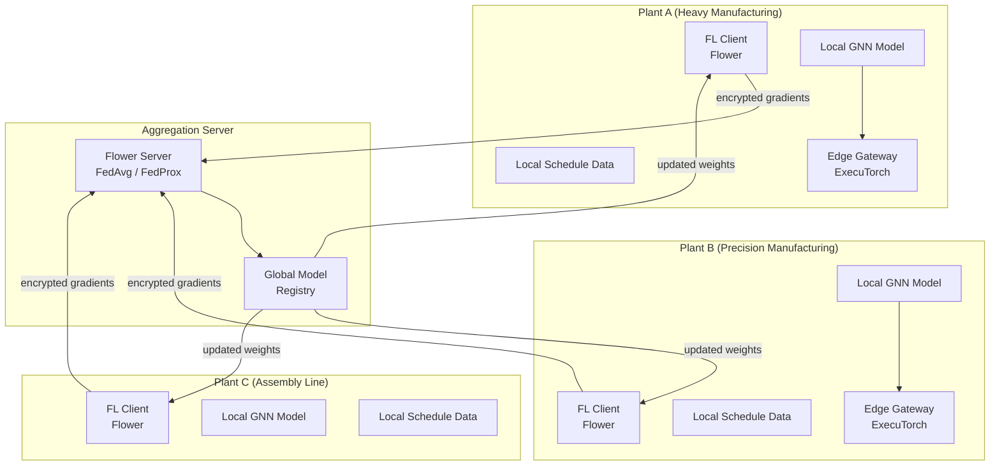

# V3 — Federated Learning & Edge AI

> **Vector scope**: Enable collaborative model improvement across multiple sites without sharing raw production data, with on-device inference at the edge (PLCs, gateways, ARM devices).

<details><summary>🇷🇺 Краткое описание</summary>

Федеративное обучение между несколькими заводами/площадками: локальные модели → агрегированная глобальная модель через Flower FL без передачи сырых данных. Edge AI: инференс GNN-предиктора и политик RL на ARM-устройствах (PLC-шлюзы) через ExecuTorch. Дифференциальная приватность (DP-SGD), гомоморфное шифрование градиентов, zero-trust attestation.
</details>

---

## 1. Architecture



---

## 2. Federated Learning Stack

| Component | Library | Version | Role |
|-----------|---------|---------|------|
| FL framework | Flower | 1.13+ | Client/server orchestration, strategy plugins |
| Aggregation | FedAvg / FedProx | built-in | Gradient aggregation with heterogeneity tolerance |
| Privacy | Opacus (DP-SGD) | 1.5+ | Differential privacy per-client |
| Encryption | TenSEAL (CKKS) | 0.3+ | Homomorphic encryption of gradient updates |
| Transport | gRPC + mTLS | — | Secure gradient transport |
| Model format | PyTorch 2.6 | — | Base model shared across clients |

---

## 3. Training Protocol

```
Round r:
  1. Server sends global model weights W_r to selected clients
  2. Each client k:
     a. Fine-tunes W_r on local data D_k for E local epochs
     b. Clips per-sample gradients (max_norm = C)
     c. Adds Gaussian noise σ (DP-SGD, ε = 8.0, δ = 1e-5)
     d. Encrypts gradient update ΔW_k with CKKS
     e. Sends encrypted ΔW_k to server
  3. Server:
     a. Decrypts and aggregates: W_{r+1} = W_r + η · Σ(n_k/n) · ΔW_k
     b. Validates: global model ≥ 95% of best local performance
     c. Pushes W_{r+1} to model registry
```

---

## 4. Privacy Guarantees

| Layer | Mechanism | Guarantee |
|-------|-----------|-----------|
| Sample-level | DP-SGD (Opacus) | (ε=8, δ=10⁻⁵)-differential privacy per round |
| Gradient transport | CKKS homomorphic encryption | Server never sees plaintext gradients |
| Communication | mTLS + certificate pinning | No MITM, no eavesdropping |
| Attestation | TEE-based client identity (roadmap) | Hardware-verified participant identity |
| Audit | Gradient contribution log | Per-round provenance trail |

---

## 5. Edge AI — ExecuTorch Deployment

### 5.1 Target Devices

| Device Class | Example | Compute | Memory | Model |
|-------------|---------|---------|--------|-------|
| Industrial gateway | NVIDIA Jetson Orin Nano | ARM Cortex-A78AE + GPU 1024 CUDA | 8 GB | Full GNN |
| PLC companion | Raspberry Pi 5 / Coral Edge TPU | ARM Cortex-A76 / Edge TPU 4 TOPS | 4-8 GB | Quantized GNN (INT8) |
| Microcontroller | STM32MP2 | Cortex-A35 + Cortex-M33 | 1 GB | Tiny MLP (distilled) |

### 5.2 Model Export Pipeline

```python
import torch
from executorch.exir import to_edge

# Export GNN weight predictor for ARM
model = WeightPredictor(...)
model.load_state_dict(torch.load("gnn_weights.pt"))
model.eval()

example_input = (torch.randn(1, 128),)  # node features
edge_program = to_edge(torch.export.export(model, example_input))
edge_program.to_executorch().save("gnn_predictor.pte")
```

### 5.3 Edge Inference Loop

```
Every T seconds (configurable, default 30s):
  1. Read telemetry from NATS JetStream (local subscriber)
  2. Build feature vector (utilization, queue, disruption flags)
  3. Run ExecuTorch inference → updated ATCS weights
  4. Publish weights to NATS topic: ml.edge.weights.{plant_id}
  5. Solver uses fresh weights on next dispatch cycle
```

---

## 6. Multi-Site Topology

| Topology | Use Case | Aggregation |
|----------|----------|------------|
| Star (hub-and-spoke) | Corporate HQ aggregates from N plants | Central Flower server |
| Hierarchical | Region → Global (e.g., EU plants → Europe hub → global) | 2-level FedAvg |
| Peer-to-peer (roadmap) | Air-gapped plants, no central server | Gossip-based aggregation |

---

## 7. Data Heterogeneity Handling

Manufacturing sites differ in scale, product mix, and disruption patterns. This creates non-IID data distributions.

| Challenge | Mitigation |
|-----------|-----------|
| Different product portfolios | FedProx with μ=0.01 proximal term |
| Different scale (10 vs. 1000 WCs) | Weighted aggregation by dataset size |
| Missing state transitions | Shared state embedding layer (frozen) + local heads |
| Imbalanced disruption data | Synthetic minority oversampling at client |

---

## 8. Integration Points

| Event | Source | Target |
|-------|--------|--------|
| `fl.round.started` | FL server | Monitoring dashboard |
| `fl.round.completed` | FL server | Model registry |
| `fl.client.update.sent` | FL client | Local audit log |
| `ml.edge.weights.{plant_id}` | Edge gateway | Solver orchestrator |
| `ml.promotions.federated` | Model registry | All clients |

---

## References

- Beutel, D. et al. (2022). Flower: A Friendly Federated Learning Framework. *arXiv:2007.14390*.
- Abadi, M. et al. (2016). Deep Learning with Differential Privacy. *CCS*.
- Meta (2025). ExecuTorch Documentation.
- ADR-016: Federated Learning & Edge AI architecture.
