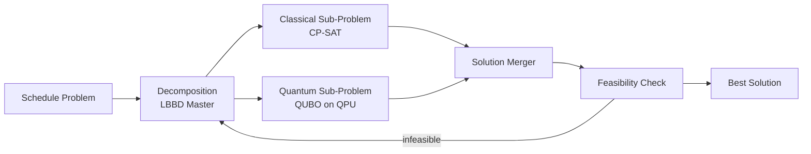

# V4 — Quantum Readiness

> **Vector scope**: Prepare the scheduling solver for quantum and quantum-inspired hardware via QUBO formulation, hybrid classical-quantum solvers, and an abstraction layer for diverse QPU backends.

<details><summary>🇷🇺 Краткое описание</summary>

Квантовая готовность: формулировка задачи расписания как QUBO (Quadratic Unconstrained Binary Optimization) для совместимости с квантовыми анилерами (D-Wave) и вариационными квантовыми алгоритмами (QAOA, VQE). Абстракция QPU Backend — D-Wave Leap, PennyLane, Amazon Braket, IBM Qiskit. Гибридные решатели: классический CP-SAT + квантовый QUBO sub-problem.
</details>

---

## 1. Why Quantum for Scheduling?

Combinatorial scheduling (MO-FJSP-SDST) belongs to the NP-hard problem class where quantum advantage is theoretically possible for:

| Regime | Classical | Quantum Potential |
|--------|-----------|-------------------|
| Exact solve (< 100 ops) | CP-SAT, optimal in ms–s | No advantage |
| Medium scale (100–2000 ops) | CP-SAT, time-boxed | Marginal, QAOA depth limits |
| Large scale (2000–50K ops) | Heuristics + LBBD | Quantum annealing may find better local optima |
| Hyper-scale (50K+ ops) | Decomposition only | Future fault-tolerant QC |

**Current stance (2026)**: Quantum annealing (D-Wave Advantage2, 7000+ qubits) is the most practical backend. Gate-model QPUs lack qubit count for production scheduling. Syn-APS provides the abstraction layer now so that quantum hardware can be plugged in as it matures.

---

## 2. QUBO Formulation

### 2.1 Binary Encoding

For each operation $j$ and eligible machine $m$ at time slot $t$:

$$x_{j,m,t} \in \{0, 1\}$$

$x_{j,m,t} = 1$ means operation $j$ runs on machine $m$ starting at time $t$.

### 2.2 Objective (QUBO)

$$\min \; \mathbf{x}^T Q \mathbf{x}$$

where the $Q$ matrix encodes:

| Term | Contribution to $Q$ | Weight |
|------|---------------------|--------|
| Makespan | Penalize late completion | $\alpha$ |
| Setup cost | Penalize state transitions | $\beta$ |
| Assignment uniqueness | Each op assigned once (penalty) | $P_1$ (large) |
| Machine capacity | No overlap (penalty) | $P_2$ (large) |
| Precedence | Successor after predecessor (penalty) | $P_3$ (large) |

### 2.3 Penalty Strengths

Constraint penalties must dominate the objective:

$$P_1, P_2, P_3 \gg \alpha + \beta$$

Typical ratio: $P / \text{obj\_weight} \geq 10$.

---

## 3. QPU Backend Abstraction

```python
from abc import ABC, abstractmethod

class QpuBackend(ABC):
    """Abstract QPU interface for QUBO solving."""

    @abstractmethod
    def solve_qubo(
        self,
        Q: dict[tuple[int, int], float],
        num_reads: int = 1000,
        time_limit_s: float = 30.0,
    ) -> list[dict[int, int]]:
        """Submit QUBO and return list of sample solutions.

        Args:
            Q: Upper-triangular QUBO matrix as {(i,j): weight}.
            num_reads: Number of solution samples.
            time_limit_s: Maximum wall-clock time.

        Returns:
            List of solutions, each {variable_index: 0 or 1}.
        """

class DWaveBackend(QpuBackend):
    """D-Wave Leap / Ocean SDK backend."""
    ...

class SimulatedAnnealingBackend(QpuBackend):
    """Classical simulated annealing (Neal) for development/testing."""
    ...

class PennyLaneQAOABackend(QpuBackend):
    """PennyLane QAOA backend for gate-model QPUs."""
    ...

class BraketBackend(QpuBackend):
    """Amazon Braket backend (IonQ, Rigetti, D-Wave)."""
    ...
```

---

## 4. Hybrid Classical-Quantum Solver



**Strategy**: The LBBD master (HiGHS) decomposes the problem. Small, dense sub-problems are routed to quantum; large, sparse sub-problems to CP-SAT. The router decides based on sub-problem size and graph density.

---

## 5. Quantum Hardware Landscape (2026)

| Platform | Type | Qubits | Connectivity | SDK | Status |
|----------|------|--------|-------------|-----|--------|
| D-Wave Advantage2 | Annealer | 7000+ | Zephyr graph | Ocean | Production |
| IBM Heron / Flamingo | Gate (superconducting) | 1000+ | Heavy-hex | Qiskit | Research |
| IonQ Forte Enterprise | Gate (trapped ion) | 36 algorithmic | All-to-all | Native / Braket | Research |
| Rigetti Ankaa-3 | Gate (superconducting) | 84 | Square lattice | pyQuil / Braket | Research |
| QuEra Aquila | Neutral atom | 256 | Programmable | Bloqade / Braket | Experimental |
| PennyLane (Xanadu) | Simulator + photonic | — | — | PennyLane | Dev/Simulator |

---

## 6. Benchmarking Protocol

| Metric | Description |
|--------|-------------|
| **Solution quality** | Objective value vs. CP-SAT optimum (if known) |
| **Time-to-solution** | Wall-clock including queue, compilation, annealing/QAOA |
| **Qubit utilisation** | Logical qubits used vs. available |
| **Embedding overhead** | Minor embedding penalty (D-Wave) or circuit depth (gate) |
| **Cost per solve** | QPU seconds × per-second pricing |

---

## 7. Migration Path

| Phase | Horizon | Gate |
|-------|---------|------|
| **Phase 0**: QUBO formulation + simulated annealing backend | Now | Unit tests pass, SA matches CP-SAT within 5% on small instances |
| **Phase 1**: D-Wave cloud integration | 6 months | D-Wave Advantage2 solves 100-op sub-problems |
| **Phase 2**: Hybrid LBBD + quantum sub-problem | 12 months | Quantum sub-solver integrated in production LBBD loop |
| **Phase 3**: Gate-model QAOA backend | 24+ months | When QPU qubit count ≥ 1000 logical with error correction |
| **Phase 4**: Fault-tolerant quantum solver | 5+ years | End-to-end quantum solve for ≥ 5000 operations |

---

## 8. Risk Matrix

| Risk | Probability | Impact | Mitigation |
|------|------------|--------|-----------|
| Quantum advantage not realized for scheduling | High (2026) | Low | Classical remains primary; quantum is additive |
| QUBO embedding too large for QPU | Medium | Medium | Decomposition + sub-problem routing |
| QPU queue times too long for real-time | High | Medium | Async solve, fallback to SA/CP-SAT |
| Vendor lock-in | Medium | Medium | QPU abstraction layer, multi-backend |
| API deprecation / pricing changes | Medium | Low | Simulated annealing always available locally |

---

## References

- Glover, F. et al. (2019). Quantum Bridge Analytics I: A Tutorial on Formulating QUBO Models. *4OR*.
- D-Wave Systems (2025). Ocean SDK Documentation.
- Bergholm, V. et al. (2022). PennyLane: Automatic Differentiation of Hybrid Quantum-Classical Computations.
- Farhi, E. et al. (2014). A Quantum Approximate Optimization Algorithm. *arXiv:1411.4028*.
- ADR-017: Quantum Readiness abstraction layer.
