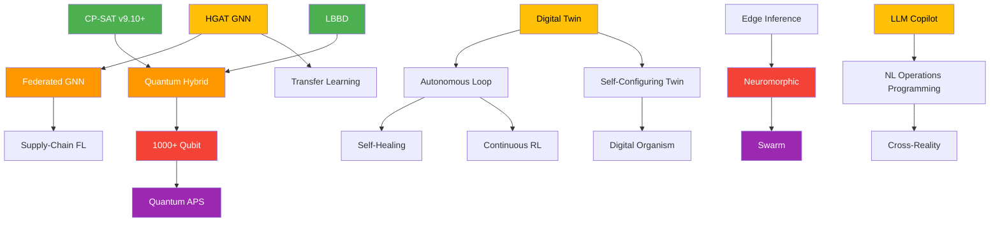

# Research Roadmap 2025 — 2075

> **Purpose**: Technology Readiness Level (TRL) progression plan across four horizons, mapping SynAPS from industrial-grade scheduling platform to autonomous, self-evolving operational intelligence.

🇷🇺 Краткое описание

Дорожная карта на 50 лет, разбитая на 4 горизонта. Каждая возможность привязана к уровню TRL и ожидаемому влиянию на операционные KPI. Ближний горизонт (2025-2030): точные решатели, GNN-советник, LLM-копилот. Средний (2030-2040): федеративное обучение, квантовый гибрид, V2X-интеграция. Дальний (2040-2055): автономное планирование, самообучающиеся операционные среды. Запредельный (2055-2075): bio-inspired, сознательные операционные сети.

---

## TRL Scale (ISO 16290)

| TRL | Gate | Description |
|-----|------|-------------|
| 1–2 | Research | Basic principles observed, concept formulated |
| 3–4 | Validation | Experimental proof-of-concept, lab validation |
| 5–6 | Demonstration | Technology validated/demonstrated in relevant environment |
| 7–8 | Qualification | System prototype in operational environment |
| 9 | Production | Actual system proven in operational environment |

---

## Horizon 1 — Near Term (2025–2030): Enterprise-Grade APS

**Theme**: Operationally ready MO-FJSP-SDST solver with ML advisory and NL interface.

| # | Capability | Current TRL | Target TRL | Key Milestones |
|---|-----------|-------------|------------|----------------|
| N1 | CP-SAT exact solver (OR-Tools v9.10+) | 7 | 9 | Validated on Brandimarte/Kacem/Fattahi benchmarks; sub-minute solve for 500-operation instances |
| N2 | ATCS/GREED dispatch heuristic | 8 | 9 | < 50 ms for 2000-operation instances; field-proven in 3+ domains |
| N3 | LBBD hybrid decomposition | 4 | 7 | Master (HiGHS MIP) + subproblem (CP-SAT); tested on 5000+ operation instances |
| N4 | HGAT weight predictor | 3 | 6 | Inference < 100 ms; weight quality within 5% of expert-tuned; PyG + ONNX Runtime |
| N5 | LLM Copilot (SGLang + GLM-5 API / GLM-4-32B on-prem) | 4 | 7 | NL→APS-SQL pipeline; proactive alert generation; on-prem deployment |
| N6 | RAG knowledge base (PG18 + pgvector) | 5 | 8 | HNSW index on production docs; multilingual-e5-large embeddings |
| N7 | Digital Twin (SimPy + TorchRL) | 3 | 6 | Validated site simulation; offline RL policy quality ≥ ATCS baseline |
| N8 | Event Sourcing backbone (NATS 2.12+) | 6 | 9 | Outbox-first pattern; idempotent replay; ClickHouse projection |
| N9 | Incremental repair solver | 7 | 9 | Hot-swap disrupted segments in < 200 ms |
| N10 | Multi-domain schema validation | 5 | 8 | 8+ industry domain templates passing schema tests |

### N-Horizon KPI Targets

| KPI | Baseline (manual) | Target |
|-----|-------------------|--------|
| Makespan reduction | — | ≥ 12–18% vs. priority-rule dispatch |
| Schedule generation time (500 ops) | > 60 s | < 10 s (CP-SAT) |
| Rescheduling latency | > 5 min (manual) | < 500 ms (incremental repair) |
| NL query → answer | N/A | < 3 s (LLM copilot) |

---

## Horizon 2 — Mid Term (2030–2040): Connected & Adaptive

**Theme**: Federated multi-site intelligence, quantum-hybrid optimization, autonomous control loops.

| # | Capability | Current TRL | Target TRL | Key Milestones |
|---|-----------|-------------|------------|----------------|
| M1 | Federated Learning (Flower FL) | 3 | 8 | Cross-site GNN training without raw data sharing; L3 differential privacy (ε ≤ 1) |
| M2 | ExecuTorch edge inference | 2 | 7 | GNN inference on ARM PLCs at < 20 ms; OTA model update pipeline |
| M3 | Quantum-hybrid QUBO solver | 2 | 5 | 100-qubit QUBO subproblems integrated with classical LBBD master |
| M4 | QAOA variational circuits (PennyLane) | 1 | 4 | Circuit depth ≤ 20; quality ratio ≥ 0.85 vs. classical |
| M5 | Autonomous rescheduling loop | 3 | 7 | Closed-loop: event → digital twin → solver → dispatch; human-on-the-loop |
| M6 | V2X site integration | 1 | 5 | AGV/AMR routing co-optimized with FJSP schedule via shared constraint model |
| M7 | Prescriptive analytics dashboard | 4 | 8 | What-if scenario comparison; Pareto front visualization; decision audit trail |
| M8 | Cross-domain transfer learning | 2 | 6 | GNN pre-trained on metallurgy transfers to pharma with < 30% fine-tuning data |
| M9 | Hierarchical multi-site planning | 2 | 6 | Campaign-level → line-level → machine-level cascade; LBBD decomposition |
| M10 | Carbon-aware scheduling objective | 2 | 7 | Energy grid carbon intensity as dynamic objective coefficient |

### M-Horizon KPI Targets

| KPI | Baseline (N-Horizon) | Target |
|-----|----------------------|--------|
| Multi-site convergence | N/A | FL model converges within 20 rounds (non-IID) |
| Edge inference latency | 100 ms (server) | < 20 ms (ARM PLC) |
| Quantum subproblem size | N/A | 100 logical qubits useful |
| Human intervention rate | ~20% of schedules | < 5% of schedules |
| Carbon intensity reduction | — | ≥ 8% vs. carbon-unaware baseline |

---

## Horizon 3 — Far Term (2040–2055): Self-Evolving Operations

**Theme**: Self-learning operating networks, emergent optimization, neuromorphic control, supply-chain-wide orchestration.

| # | Capability | Current TRL | Target TRL | Key Milestones |
|---|-----------|-------------|------------|----------------|
| F1 | Neuromorphic scheduling co-processor | 1 | 5 | Spiking neural networks for real-time dispatch on Loihi-class chips |
| F2 | 1000+ qubit optimization | 1 | 6 | Error-corrected quantum routing for full FJSP subproblems |
| F3 | Self-configuring digital twin | 2 | 7 | Auto-calibrated from IoT telemetry; zero manual modeling effort |
| F4 | Supply-chain FJSP federation | 1 | 5 | Multi-company FL with homomorphic encryption (L4 privacy) |
| F5 | Emergent objective discovery | 1 | 4 | System proposes new objective functions from operational data patterns |
| F6 | Natural-language operations programming | 2 | 7 | Full plan specification via NL dialogue; LLM generates constraint models |
| F7 | Self-healing operational networks | 1 | 5 | Autonomous topology reconfiguration on machine failure (no human) |
| F8 | Continuous learning in production | 2 | 7 | Online RL with safety constraints; zero sim-to-real gap |

### F-Horizon KPI Targets

| KPI | Baseline (M-Horizon) | Target |
|-----|----------------------|--------|
| Full autonomy rate | 95% | 99.5% (human override < 0.5%) |
| Simulation fidelity | 90% | > 99% (self-calibrating) |
| Cross-company FL | single org | 10+ organizations |
| Objective discovery | manual | ≥ 2 novel KPIs surfaced per year |

---

## Horizon 4 — Visionary (2055–2075): Operational Consciousness

**Theme**: Bio-inspired, self-aware operational ecosystems. Speculative but directionally anchored.

| # | Capability | Speculation Level | Description |
|---|-----------|-------------------|-------------|
| V1 | Swarm scheduling | High | Ant-colony / bee-inspired decentralized coordination across 10,000+ agents |
| V2 | Quantum error-corrected APS | High | Full FJSP solved on fault-tolerant quantum hardware natively |
| V3 | Digital organism networks | Very High | Self-replicating operational modules that evolve layout and process flow |
| V4 | Cross-reality scheduling | High | Augmented reality overlays on physical sites merged with digital twin |
| V5 | Energy-matter co-optimization | Very High | Scheduling co-optimized with molecular-level material transformation |

---

## Roadmap Dependency Graph

**Legend**: 🟢 TRL 7+ (green) | 🟡 TRL 3–6 (yellow) | 🟠 TRL 1–3 (orange) | 🔴 TRL 1 speculative (red) | 🟣 Visionary (purple)

---

## Governance & Review Cadence

| Horizon | Review Cycle | Decision Body |
|---------|-------------|---------------|
| Near (N) | Quarterly | Engineering lead + domain SMEs |
| Mid (M) | Annually | Technical steering committee |
| Far (F) | Biennial | Research advisory board |
| Visionary (V) | Every 5 years | Scientific council |

Each capability advances through TRL gates with evidence-based promotion criteria:
- **TRL 3→4**: Published reproducible benchmark results
- **TRL 6→7**: Pilot deployment at 1+ operational site
- **TRL 8→9**: 6-month production track record, documented SLO compliance

---

*Roadmap version 1.0 — 2026-04. Next review: 2026-Q3.*
